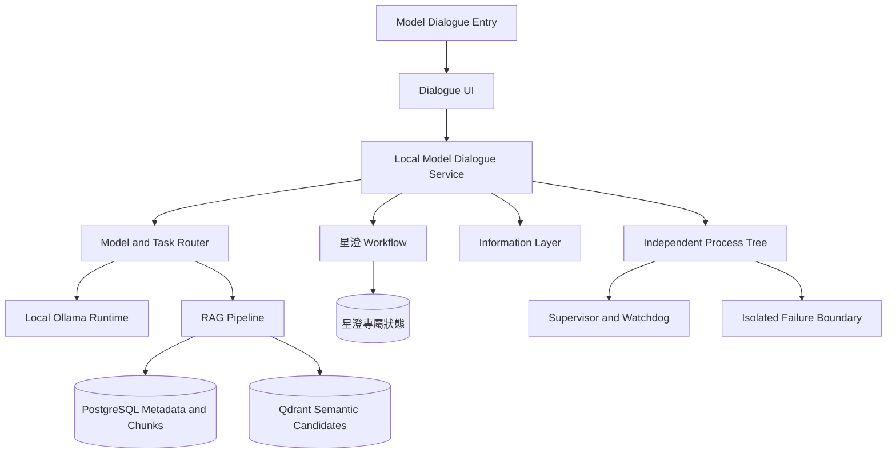

# Local Model／星澄完整架構圖

模型核心與網路功能保持分離；RAG、模型輸出及候選資料均不得自行取得治理權威。

同步基線：A528、A537、A538、A540；獨立工具啟動與關閉各自上限 5 秒，逾時 fail-closed。

本地模型預設為關閉，不參與系統預設啟動。前端提供獨立啟動／關閉開關；啟動必須由使用者明確觸發或有效單項許可，關閉後禁止自動重啟。

星澄的神經網路核心為第一方原生實作：自有 tokenizer、自有 Transformer 權重、自有訓練引擎（語料、預訓練、監督微調、偏好訓練、checkpoint）與原生推論引擎（context、KV cache、sampling、量化）。原生模型必須能在不依賴外部模型產生答案的前提下獨立完成基本語言模型推理。

Ollama 僅為本地專家與教師模型，用以產生受治理的訓練資料與專家諮詢，不得取代星澄本身的神經網路核心。權重替換一律經明確流程與審計，不得自動生效。
