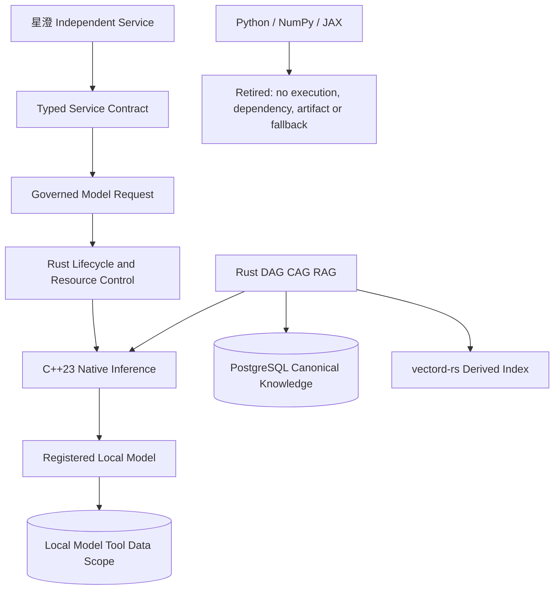

# Local Model／本地模型獨立工具完整架構圖

```mermaid
flowchart TB
  ENTRY[Governed Model Request] --> RUST[Rust Lifecycle and Resource Control]
  RUST --> CPP[C++23 Native Inference]
  CPP --> MODEL[Registered Local Model]
  MODEL --> DATA[(Local Model Tool Data Scope)]
  XCSVC[星澄 Independent Service] --> CONTRACT[Typed Service Contract]
  CONTRACT --> ENTRY
  RETIRED[Python / NumPy / JAX] --> DENY[Retired: no execution, dependency, artifact or fallback]
  RETRIEVE[Rust DAG CAG RAG] --> PG[(PostgreSQL Canonical Knowledge)]
  RETRIEVE --> VD[vectord-rs Derived Index]
  RETRIEVE --> CPP
```

`local-model` 是獨立工具，預設不啟動，只能由使用者明確開關或有效單項許可啟動。它承載自身登錄的本地模型能力，不擁有、承載或控制星澄。Rust 負責工具生命週期、設定、資源協調、CLI 與 IPC；C++23 承載其登錄的模型推論、模型載入、KV Cache、sampling 與 kernels。Python、NumPy 與 JAX／XLA 已全面退役並立即生效：不得執行、相依、產生產物、控制正式模型能力或作任何回退。

星澄是與 `local-model` 分離的獨立本地原生模型服務，但不是獨立工具且不建立工具卡片。自我學習、自動編程、自動修復及自我升級是星澄服務內部能力。修復方案必須具證據、範圍、風險、回復與審計；無法確定安全時停止，不得硬修復、直接覆蓋或重置。星澄的身分、人格、記憶、對話、訓練、權重、修復知識與 runtime 記錄只能存在星澄專屬資料域；其他元件只能取得最小型別化結果或不透明參照。

Ollama 只作登錄的本地教師或專家，不取代星澄。視窗關閉須在 5 秒內停止 `local-model` 自身後端及其擁有的模型程序，但不得停止獨立的星澄服務。
