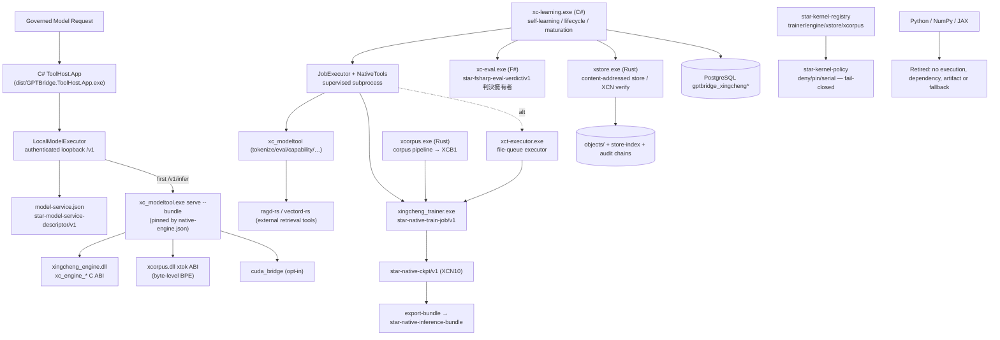

# Local Model／本地模型獨立工具完整架構圖

```mermaid
flowchart TB
  ENTRY[Governed Model Request] --> HOST["C# ToolHost.App<br/>(dist/GPTBridge.ToolHost.App.exe)"]
  HOST --> EXEC["LocalModelExecutor<br/>authenticated loopback /v1"]
  EXEC --> DESC["model-service.json<br/>star-model-service-descriptor/v1"]
  EXEC -->|first /v1/infer| SERVE["xc_modeltool.exe serve --bundle<br/>(pinned by native-engine.json)"]
  SERVE --> ENGINE["xingcheng_engine.dll<br/>xc_engine_* C ABI"]
  SERVE --> TOK["xcorpus.dll xtok ABI<br/>(byte-level BPE)"]
  SERVE --> CUDALANE["cuda_bridge (opt-in)"]

  LEARN["xc-learning.exe (C#)<br/>self-learning / lifecycle / maturation"] --> JEXEC["JobExecutor + NativeTools<br/>supervised subprocess"]
  JEXEC --> MODELTOOL["xc_modeltool (tokenize/eval/capability/…)"]
  JEXEC --> TRAINER["xingcheng_trainer.exe<br/>star-native-train-job/v1"]
  JEXEC -.alt.-> XQ["xct-executor.exe<br/>file-queue executor"]
  XQ --> TRAINER

  LEARN --> EVALF["xc-eval.exe (F#)<br/>star-fsharp-eval-verdict/v1 判決擁有者"]
  LEARN --> XSTORE["xstore.exe (Rust)<br/>content-addressed store / XCN verify"]
  XCORP["xcorpus.exe (Rust)<br/>corpus pipeline → XCB1"]
  XCORP --> TRAINER
  TRAINER --> CKPT["star-native-ckpt/v1 (XCN10)"]
  CKPT --> BUNDLE["export-bundle →<br/>star-native-inference-bundle"]

  LEARN --> PG[(PostgreSQL gptbridge_xingcheng*)]
  XSTORE --> OBJ[(objects/ + store-index + audit chains)]
  MODELTOOL --> RETRIEVE["ragd-rs / vectord-rs (external retrieval tools)"]

  KREG["star-kernel-registry<br/>trainer/engine/xstore/xcorpus"] --> KPOL["star-kernel-policy<br/>deny/pin/serial — fail-closed"]

  RETIRED[Python / NumPy / JAX] --> DENY[Retired: no execution, dependency, artifact or fallback]
```

`local-model` 是獨立工具，預設不啟動，只能由使用者明確開關或有效單項許可啟動。它承載自身登錄的本地模型能力，不擁有、承載或控制星澄。工具宿主與治理層為 **C#**（`GPTBridge.ToolHost.App` + `xc-learning.exe`）；C++23 承載模型推論、訓練、KV Cache、sampling 與 kernels（`xc_modeltool`、`xingcheng_trainer`、`engine*.dll`）；Rust 承載不受信任輸入邊界與資料面（`xc-format` XCN 標頭、`xc-runtime-host` 單一宿主租約、`xstore` 內容定址儲存、`xcorpus` 語料管線 + `xtok` tokenizer ABI）；F# `xc-eval.exe` 是評估判決的唯一擁有者（引擎 `passed` 僅為證據，缺 `xc-eval` fail-closed `EVAL_OWNER_UNAVAILABLE`）。Python、NumPy 與 JAX 已全面退役並立即生效。

星澄是與 `local-model` 分離的獨立本地原生模型服務（`independent-privileged-institution` 子 manifest，無工具卡片）。自我學習、自動編程、自動修復及自我升級是星澄服務內部能力。修復方案必須具證據、範圍、風險、回復與審計；無法確定安全時停止，不得硬修復、直接覆蓋或重置。星澄的身分、人格、記憶、對話、訓練、權重、修復知識與 runtime 記錄只能存在星澄專屬資料域；其他元件只能取得最小型別化結果或不透明參照。

星澄融合 Transformer Decoder 架構：Decoder-only 單向因果注意力逐 token 自回歸生成。「融合」指混合式 Decoder 堆疊：gated linear attention（DeltaNet）與週期性全注意力層交錯（`full_attention_interval`），搭配 RoPE（partial rotary + YaRN 擴展）、QK-norm、注意力輸出閘控、SwiGLU FFN、含共享專家的 MoE（sigmoid router top-K、aux-free balance 可選）、MLA 低秩潛在 KV、CSA2 壓縮稀疏注意力、MTP stack 多 token 預測、Gemma4 hybrid 與 vision early-fusion——由 `generation: xc-fused-1` 契約釘選並以 `--canoncheck`/`--canonical-materialize` 提供可執行證據。checkpoint 契約為 XCN1 `star-native-ckpt/v1`，現行寫出 **XCN10**（v5 Gemma-A4B、v6 sigmoid router、v7 MLA+aux-free+MTP、v8 YaRN、v9 gemma4 marker、v10 MTP stack）。資料面為 XCB1 `star-token-batch/v1` 二進位 token batch（JSONL 僅作已註冊資料集的可讀回退）。訓練器自我探針共 17 項（smoke…canoncheck…freezecheck）。Kernel Registry（`star-kernel-registry`）在 trainer/engine/xstore/xcorpus 四 lane 各有清單，`star-kernel-policy` 提供 fail-closed 的 deny/釘選/序列化閘門。

星澄原生多模態採「早期融合」：`use_vision` 啟用時影像 patch 經線性投影 `vision.patch_proj` 進入同一條 Decoder 主流；prefix cache 不承接 vision span，DPO 拒絕 vision 輸入，全部 fail-closed。

長文本推理的記憶與快取採原生實作：paged KV pool、prefix cache（跨 `generate` 最長相符前綴，快照值位元一致）、KV-INT8 每 token/head 對稱量化（opt-in env `XINGCHENG_CPP_KV_INT8`）、`star-delta-state/v1` 狀態快照與 `star-prefill-artifact/v1` P/D 交接。`xc_modeltool cache-smoke`/`state-snapshot`/`mtp-draft-probe` 提供可執行證據。

世代繼任契約（能力／架構升級後刪除前代）：`ModelLifecycle` 在 `activate` 時把前代完整記錄攜入新代 `metadata["succeeded_from"]` 並記 `weights_succession`；實體刪除前代 bundle 必須先完成繼任記錄且 lifecycle 已持久化（`PruneSupersededGeneration` 缺繼任 fail-closed 保留），刪除後前代移入 retired 並標 `succeeded_by`/`data_carried_to`。在役世代永不退休。

Ollama 只作登錄的本地教師或專家（teacher-distillation 受管 loopback），不取代星澄。視窗關閉須在 5 秒內停止 `local-model` 自身後端及其擁有的模型程序，但不得停止獨立的星澄服務。

## 星澄模型規模邊界

星澄所有可發布模型組態的總參數量不設下限，僅設 20B（含）總量上限；任何規模均可依實際能力、效能與資源條件自適化。完整能力基線同樣不設參數量下限。參數量只界定上限與資源邊界，不得取代能力測試、品質證據或發布條件。

## 星澄純原生邊界

星澄的原始碼、正式執行、訓練、推論、學習、評估、資料處理及內部工具只准使用 C、C++23、C#、F# 與 Rust。不得使用 Go、JavaScript、Bun、WebView 腳本、Python 或其他語言，也不得把外部模型、雲端服務、外部執行引擎、第三方推論／訓練框架或外部能力服務納入星澄執行路徑。作業系統、硬體驅動、核准編譯工具鏈及受治理型別通道只提供平台邊界，不取得星澄能力、模型或資料所有權。

星澄完整原生領域不受全專案通用的模組、檔案、類別、函式、宣告或公開入口行數／數量上限約束；不得以通用原始碼規模檢查阻擋星澄。此豁免只移除機械性行數限制，不豁免正確性、安全、權限、資源、介面、測試、審計、發布與可維護性要求。

星澄可以透過自身 Rust／C# 原生網路路徑存取網際網路，用於搜尋、擷取公開資料、查詢修復方案及完成受許可任務。網路請求須具明確目的與範圍，採受限並行、期限、大小上限、來源記錄、內容驗證及完整審計；外部內容一律是不受信任輸入，不取得權威，也不得因此引入外部模型、雲端推論或第三方執行框架。
