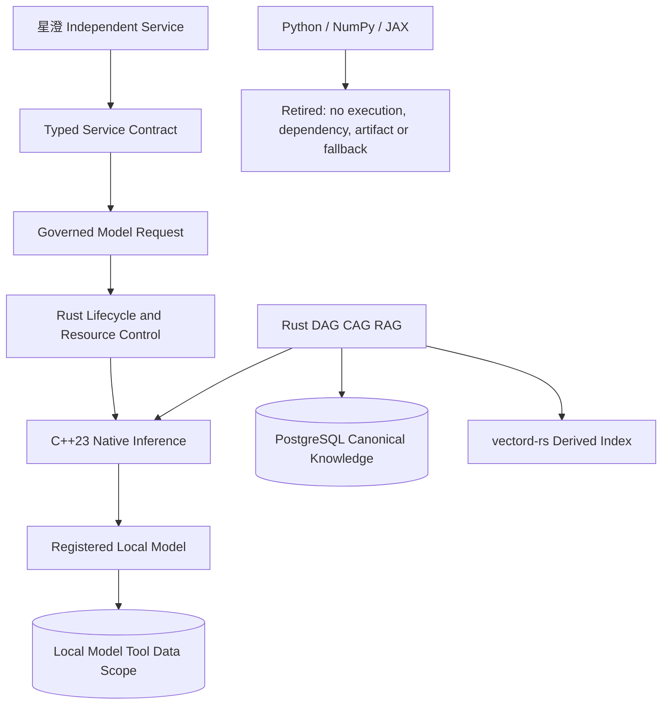

# Local Model／本地模型獨立工具完整架構圖

```mermaid
flowchart TB
  ENTRY[Governed Model Request] --> RUST[Rust Lifecycle and Resource Control]
  RUST --> CPP[C++23 Native Inference]
  CPP --> MODEL[Registered Local Model]
  MODEL --> DATA[(Local Model Tool Data Scope)]
  XCSVC[星澄 Independent Service] --> CONTRACT[Typed Service Contract]
  CONTRACT --> ENTRY
  RETIRED[Python / NumPy / JAX] --> DENY[Retired: no execution, dependency, artifact or fallback]
  RETRIEVE[Rust DAG CAG RAG] --> PG[(PostgreSQL Canonical Knowledge)]
  RETRIEVE --> VD[vectord-rs Derived Index]
  RETRIEVE --> CPP
```

`local-model` 是獨立工具，預設不啟動，只能由使用者明確開關或有效單項許可啟動。它承載自身登錄的本地模型能力，不擁有、承載或控制星澄。Rust 負責工具生命週期、設定、資源協調、CLI 與 IPC；C++23 承載其登錄的模型推論、模型載入、KV Cache、sampling 與 kernels。Python、NumPy 與 JAX／XLA 已全面退役並立即生效：不得執行、相依、產生產物、控制正式模型能力或作任何回退。

星澄是與 `local-model` 分離的獨立本地原生模型服務，但不是獨立工具且不建立工具卡片。自我學習、自動編程、自動修復及自我升級是星澄服務內部能力。修復方案必須具證據、範圍、風險、回復與審計；無法確定安全時停止，不得硬修復、直接覆蓋或重置。星澄的身分、人格、記憶、對話、訓練、權重、修復知識與 runtime 記錄只能存在星澄專屬資料域；其他元件只能取得最小型別化結果或不透明參照。

星澄融合 Transformer Decoder 架構：與同時期採用 Encoder 的 BERT 不同，GPT 系列完全基於 Transformer 的解碼器（Decoder-only）堆疊而成，星澄自訓權重循同一路線——單向因果注意力（causal mask）逐 token 自回歸生成，無 encoder、無 encoder-decoder cross-attention。「融合」指混合式 Decoder 堆疊：gated linear attention（deltanet）與週期性全注意力層交錯（`full_attention_interval`），搭配 RoPE（partial rotary）、QK-norm、注意力輸出閘控、SwiGLU FFN 與含共享專家的 MoE（softmax router top-K 選取、權重歸一、共享專家常駐、load-balance aux；訓練器 `--mixcheck` 提供拓撲/路由/重算/隔離的可執行證據）；checkpoint 契約為 XCN4（XCN3 加 vision early-fusion 區塊）。全注意力層為多頭注意力（MHA/GQA）：`num_attention_heads` 個 q-head 各自只讀自己的 q slice 與所屬 kv group（`h / (heads / kv_heads)`）的 k/v——各 head 是互不干擾的獨立視角，kv-head 在 group 內共享；訓練器探針 `--headcheck` 以逐 head 權重微擾提供可執行證據（head 隔離、kv-group 共享映射、causal softmax 歸一、head 非退化），`--maskcheck` 覆蓋因果邊界。全域注意力層另支援 DeepSeek-V4.1-Flash 的 CSA2 壓縮稀疏注意力（`csa_*` 欄位）：raw KV 覆蓋限於滑窗（`csa_window_size`/`sliding_window_size`），遠距上下文經每 `csa_compress_ratio` token 一顆的壓縮 latent KV（`wck`/`wcv` 壓縮器，獨立 RoPE 基頻 `csa_compress_rope_theta`）以 top-K 選取（`csa_topk`），輕量 indexer（`wiq`/`wik`）以 CE 蒸餾對齊主注意力分佈；`csa_share_group` 分組實現 CSA2 跨層共享——組首 Full 產生共享壓縮流與索引鍵，跟隨者 Reuse（沿用 top-K）或 Reindex（自備 indexer Q 重打分）；CSA 與 MLA（`kv_lora_rank`）互斥 fail-closed，預設全關，探針 `--csacheck` 提供稀疏邊界、因果封閉、壓縮抵達、跨層共享與 indexer 梯度的可執行證據。

星澄原生多模態採「早期融合」（early fusion）：`use_vision` 啟用時，影像 patch 經線性投影 `vision.patch_proj`（hidden × patch_dim）送入與文字同一條 Decoder 主流，patch 列作為因果序列前綴、與 token embedding 共用位置與注意力；prefix cache 不承接 vision span，文本專用路徑位元不變。推論探針 `forward_vision_logits` 與 `xc_modeltool vision-smoke` 提供端到端驗證；訓練端 `vision_patches` 資料列以 -100 標籤遮蔽 patch 前綴，DPO 拒絕 vision 輸入，全部 fail-closed。

長文本推理的記憶與快取採原生實作：paged KV pool（邏輯區塊表→實體區塊按需配置，`reset_cache` 全數歸還、`kv_memory_bytes` 可稽核）、prefix cache（跨 `generate` 呼叫還原最長相符前綴，快照值與重算位元一致）、KV-INT8 每 token/head 對稱量化（opt-in 受管 env `XINGCHENG_CPP_KV_INT8`，KV 足跡約 8x 縮減，唯讀端以 dequantize 還原；CUDA 裝置端 KV 為另一 opt-in 路徑）。`xc_modeltool cache-smoke` 以前綴命中、重放位元一致與 INT8 漂移上限提供可執行證據。

世代繼任契約（能力／架構升級後刪除前代）：新代權重 `activate` 時 `ModelLifecycle` 自動把前代完整記錄——version、sha256、path 與全份 metadata（dataset_id／job／eval 資料血統）——攜入新代 `metadata["succeeded_from"]` 並記 `weights_succession` 事件；實體刪除前代 bundle 必須先完成繼任記錄且 lifecycle 已持久化（`PruneSupersededGeneration`，缺繼任記錄 fail-closed 保留），刪除成功後前代條目由 versions 移入 retired 並標記 `succeeded_by`/`data_carried_to`/`deleted_at`，活版本表不留死路徑、retired 保留完整資料。在役世代經 `RetireWeightVersion` 永不退休（fail-closed）。

Ollama 只作登錄的本地教師或專家，不取代星澄。視窗關閉須在 5 秒內停止 `local-model` 自身後端及其擁有的模型程序，但不得停止獨立的星澄服務。
## 星澄模型規模邊界

星澄所有可發布模型組態的總參數量必須介於 300M 與 20B（含）之間；低於 300M 或高於 20B 均不得成為正式模型。任何宣稱具備完整能力的基線組態不得低於 300M。參數量只界定規模與資源邊界，不得取代能力測試、品質證據或發布條件。

## 星澄純原生邊界

星澄的原始碼、正式執行、訓練、推論、學習、評估、資料處理及內部工具只准使用 C、C++23、C#、F# 與 Rust。不得使用 Go、JavaScript、Bun、WebView 腳本、Python 或其他語言，也不得把外部模型、雲端服務、外部執行引擎、第三方推論／訓練框架或外部能力服務納入星澄執行路徑。作業系統、硬體驅動、核准編譯工具鏈及受治理型別通道只提供平台邊界，不取得星澄能力、模型或資料所有權。

星澄完整原生領域不受全專案通用的模組、檔案、類別、函式、宣告或公開入口行數／數量上限約束；不得以通用原始碼規模檢查阻擋星澄。此豁免只移除機械性行數限制，不豁免正確性、安全、權限、資源、介面、測試、審計、發布與可維護性要求。

星澄可以透過自身 Rust／C# 原生網路路徑存取網際網路，用於搜尋、擷取公開資料、查詢修復方案及完成受許可任務。網路請求須具明確目的與範圍，採受限並行、期限、大小上限、來源記錄、內容驗證及完整審計；外部內容一律是不受信任輸入，不取得權威，也不得因此引入外部模型、雲端推論或第三方執行框架。
