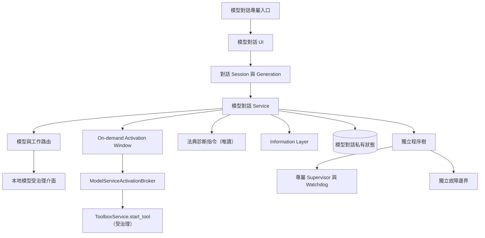

# 模型對話完整架構圖

模型對話具有獨立工具身分；本地模型提供推論能力，但不得取代模型對話的入口、session、資料及故障邊界。

同步基線：A528、A537、A538、A540；獨立工具啟動與關閉各自上限 5 秒，逾時 fail-closed。

自動路由的預設第一候選固定為星澄。星澄未啟動、不可用、不符合所需能力或被治理邊界拒絕時，才可按已登錄備援順序轉用其他模型。同步基線：A541。

送出訊息而星澄（owner：`local-model`）未啟動時，模型對話先把推論請求送入受治理 AI 通道，並透過送出進度顯示「正在啟動星澄模型服務…」；對話本身不自行開程序。使用者固定可見兩個彼此獨立的全域開關（系統自動更新、系統自動修復）與逐項「單項許可／不許可」；單項許可只綁定一個明確 action identity、證據摘要、期限與一次性執行權，不得移轉或重播。法典診斷為唯讀指令：`xingcheng_codex_alignment`（法典 × 實作對齊）與 `xingcheng_codex_mirror_check`（法典 × 架構圖同步），報告以 zh-TW 摘要顯示，不寫入法典或專案狀態。
