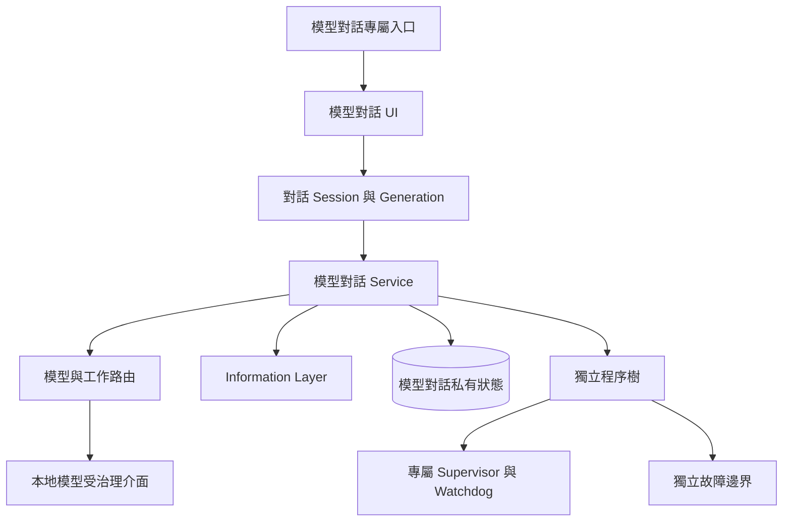

# 模型對話完整架構圖

```mermaid
flowchart TB
  ENTRY[模型對話專屬入口] --> UI[模型對話 UI]
  UI --> SESSION[對話 Session 與 Generation]
  SESSION --> SERVICE[模型對話 Service]
  SERVICE --> ROUTER[模型與工作路由]
  ROUTER --> LOCAL[本地模型受治理介面]
  SERVICE --> INFO[Information Layer]
  SERVICE --> STATE[(模型對話私有狀態)]
  SERVICE --> PROC[獨立程序樹]
  PROC --> SUP[專屬 Supervisor 與 Watchdog]
  PROC --> FAULT[獨立故障邊界]
```

模型對話具有獨立工具身分；本地模型提供推論能力，但不得取代模型對話的入口、session、資料及故障邊界。
