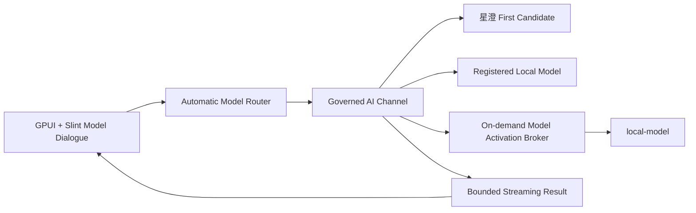

# 對話／本地 LLM 獨立工具完整架構圖

```mermaid
flowchart LR
  UI[GPUI + Slint Model Dialogue] --> ROUTER[Automatic Model Router]
  ROUTER --> INFO[Governed AI Channel]
  INFO --> XC[星澄 First Candidate]
  INFO --> OTHER[Registered Local Model]
  INFO --> BROKER[On-demand Model Activation Broker]
  BROKER --> LOCAL[local-model]
  INFO --> STREAM[Bounded Streaming Result]
  STREAM --> UI
```

`model-dialogue` 的固定顯示名稱為「對話」，正式定位為獨立本地 LLM 工具，具有自己的工具根、程序生命週期與 PostgreSQL 資料範圍，不是 `local-model` 的子模組。它可在 `local-model` 停止時自行開啟；自動路由預設星澄優先，並只透過受治理契約按需請求其他模型能力。對話不繼承星澄、`local-model` 或其他模型的身分、權限及資料；不得繞過 channel、scope、deadline、cancellation、citation 與 audit。

視窗關閉須在 5 秒內停止模型對話自身後端，但不得關閉仍被其他需求持有的模型服務。
