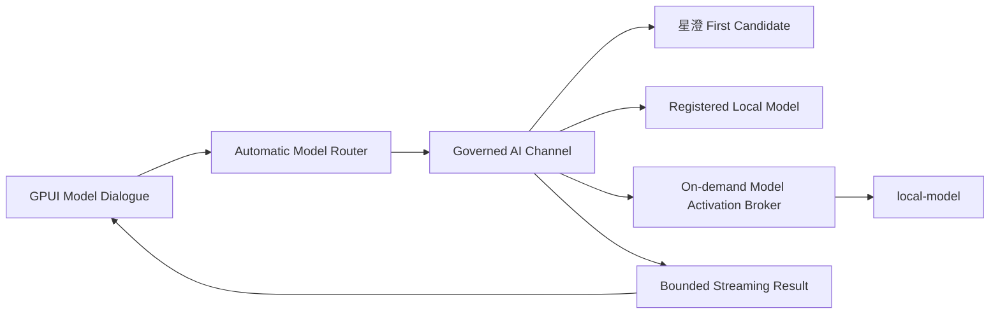

# Model Dialogue／模型對話完整架構圖

```mermaid
flowchart LR
  UI[GPUI Model Dialogue] --> ROUTER[Automatic Model Router]
  ROUTER --> INFO[Governed AI Channel]
  INFO --> XC[星澄 First Candidate]
  INFO --> OTHER[Registered Local Model]
  INFO --> BROKER[On-demand Model Activation Broker]
  BROKER --> LOCAL[local-model]
  INFO --> STREAM[Bounded Streaming Result]
  STREAM --> UI
```

`model-dialogue` 是獨立工具並可在 `local-model` 停止時自行開啟。自動路由預設星澄優先；首次送出需求時，Information Channel 可要求受治理 broker 按需啟動 `local-model`。對話工具不繼承星澄身分、權限或資料；不得繞過 channel、scope、deadline、cancellation、citation 與 audit。

視窗關閉須在 5 秒內停止模型對話自身後端，但不得關閉仍被其他需求持有的模型服務。
