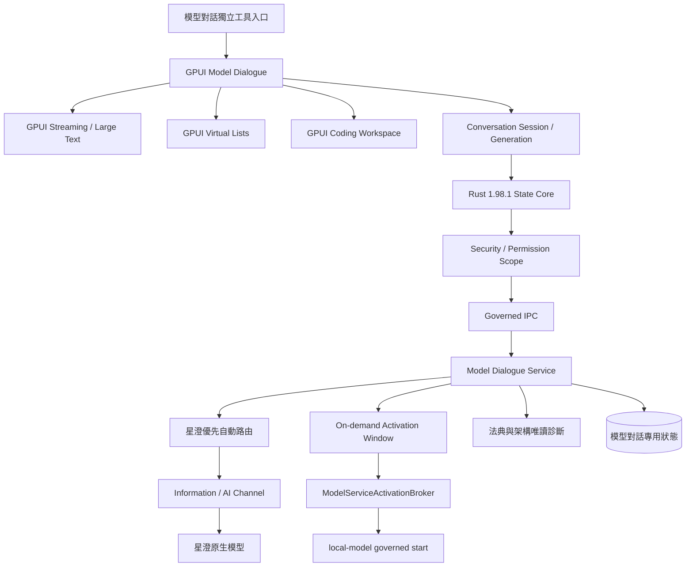

# 模型對話完整架構

```mermaid
flowchart TB
  ENTRY[模型對話獨立工具入口] --> GPUI[GPUI Model Dialogue]
  GPUI --> STREAM[GPUI Streaming / Large Text]
  GPUI --> VLIST[GPUI Virtual Lists]
  GPUI --> CODE[GPUI Coding Workspace]
  GPUI --> SESSION[Conversation Session / Generation]
  SESSION --> RUST[Rust 1.98.1 State Core]
  RUST --> SEC[Security / Permission Scope]
  SEC --> IPC[Governed IPC]
  IPC --> SERVICE[Model Dialogue Service]
  SERVICE --> ROUTER[星澄優先自動路由]
  ROUTER --> CHANNEL[Information / AI Channel]
  CHANNEL --> XC[星澄原生模型]
  SERVICE --> ACTIVATE[On-demand Activation Window]
  ACTIVATE --> BROKER[ModelServiceActivationBroker]
  BROKER --> LOCAL[local-model governed start]
  SERVICE --> DIAG[法典與架構唯讀診斷]
  SERVICE --> STATE[(模型對話專用狀態)]
```

模型對話是七個獨立工具之一，使用 GPUI 承載模型對話、Coding Workspace、大量／串流文字、虛擬清單及其他高效能原生視圖。Rust 1.98.1 擁有 UI Core、Application State、Security、IPC、Lifecycle 與 OS Integration；GPUI 不得自行建立權限或後端生命週期。

模型對話可以在 `local-model` 停止時獨立開啟；首次送出訊息後，經受管 AI Channel 及 `ModelServiceActivationBroker` 按需啟動星澄。預設路由為星澄優先，禁止直接繞過 Information Channel、權限範圍與審計。

一般設定、工具面板、表格、表單與狀態呈現由 Tauri WebView 內的原生 JavaScript ESM＋JSDoc 負責；JSDoc 提供型別與契約提示。Tauri 同時負責 Window 管理及 JS↔Rust Bridge。模型對話核心視圖不得退回重型 WebView renderer。系統診斷、效能監控、開發／治理工具及 Debug Overlay 屬 egui 工程介面，不得混入一般對話畫面。

獨立啟動及關閉須在 5 秒內完成；視窗關閉必須停止模型對話自身後端，但不得連帶關閉已由其他需求持有的星澄模型服務。

法源：B118、B123、B124、C102、B125、B126、B154。

## 法典檔案保護

檔案唯讀只作為最小必要的完整性保護，不代表權威。保留目前五份機器產生的中文法典鏡像、已註冊治理套件入口及已註冊共享層執法來源為唯讀；架構圖及其他非鏡像工作區檔案均採受管可寫，由 PostgreSQL 權限、交易、版本、current binding、同步證據與稽核維持完整性。發布程序可暫時解除鏡像唯讀，但完成驗證後必須恢復。
