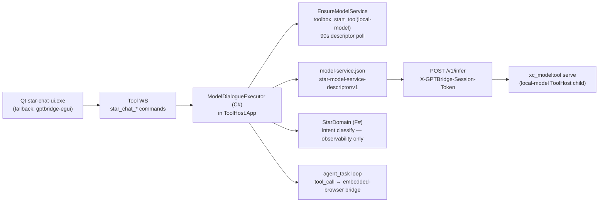

# 對話／本地 LLM 獨立工具完整架構圖

```mermaid
flowchart LR
  UI["Qt star-chat-ui.exe<br/>(fallback: gptbridge-egui)"] --> WS["Tool WS<br/>star_chat_* commands"]
  WS --> EXEC["ModelDialogueExecutor (C#)<br/>in ToolHost.App"]
  EXEC --> BROKER["EnsureModelService<br/>toolbox_start_tool(local-model)<br/>90s descriptor poll"]
  EXEC --> DESC["model-service.json<br/>star-model-service-descriptor/v1"]
  DESC --> V1["POST /v1/infer<br/>X-GPTBridge-Session-Token"]
  V1 --> SERVE["xc_modeltool serve<br/>(local-model ToolHost child)"]
  EXEC --> FS["StarDomain (F#)<br/>intent classify — observability only"]
  EXEC --> AGENT["agent_task loop<br/>tool_call → embedded-browser bridge"]
```

`model-dialogue` 是固定顯示名稱為「對話」的獨立本地 LLM 工具，具自己的工具卡片、程序樹與受管身分；其 governed runtime identity 為 `star-chat`（內含 companion manifest `star-chat`，`ui-surface` 型、無獨立程序）。UI 主面為 Qt（`star-chat-ui.exe`），fallback 為 Rust egui；GPUI 僅為未接線的 view stub，Slint 不存在。

模型呼叫路徑：`star_chat_send_message` → 讀 `xingcheng/runtime/ipc/model-service.json`（驗 schema/loopback/pid/token/lifecycle_owner/consumer_policy）→ `POST /v1/infer`（8 分鐘期限、`max_new_tokens` ≤1024、非串流單一回應；progress 僅攜 phase/message/classification）。冷啟動時 `EnsureModelService` 經主系統 WS 送 `toolbox_start_tool{local-model}` 並輪詢 descriptor + `/v1/status`（90 秒預算）。模型清單目前固定唯一 `xingcheng-native-transformer`（`routing: xingcheng-first`）；指定其他 `runtime_model` → `MODEL_NOT_INSTALLED`。`agent_task` 將模型訓練的 `<tool_call>` JSON 導向受管 loopback browser bridge（ops `browser_*`，max_steps 預設 8、硬上限 24）。F# `StarDomain` 意圖分類只作為可觀測欄位，不改變傳輸。

資料邊界：本工具**不擁有任何 PostgreSQL 表**（`direct-database-write` 在 deny 清單）；對話歷史為 UI 記憶體暫存（送訊時攜最近 ≤8 則、`context_budget_characters` 預設 10000 截最舊）。codex 合約宣告其為 `role_setting`（人格記錄）的 population_owner，寫入經受管通道而非本 executor。視窗關閉須在 5 秒內停止自身後端，但不停止仍被其他消費者使用的模型服務。
