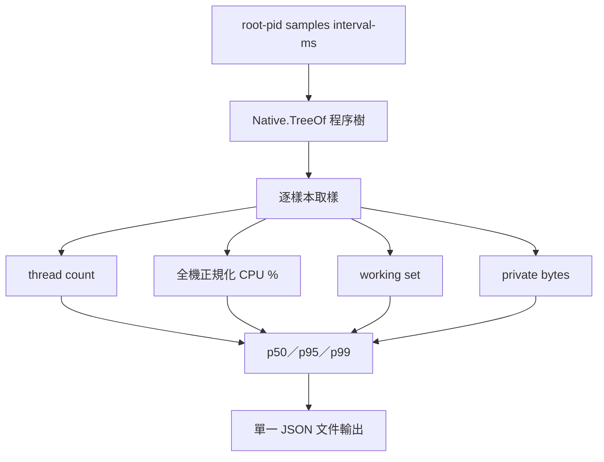

# 行程量測探針（C#）完整架構圖

`process-metrics-csharp` 是獨立服務（`standalone-service`）：P30 psutil 替代探針（`gptbridge-process-metrics <root-pid> [samples] [interval-ms]`），唯讀輸出目標程序樹的 CPU（全機正規化百分比）、working set、private bytes、執行緒數、行程數，以及取樣窗的 p50／p95／p99，合併為單一 JSON 文件。首個樣本無差值不計 CPU；程序中途結束視為缺失資料、以 null 回報，不捏造；缺失程序不以非零結束碼退出。

依 registry 依賴 `shared-layer`，經 `information-channel` 通訊。

同步基線：A537、A538。
