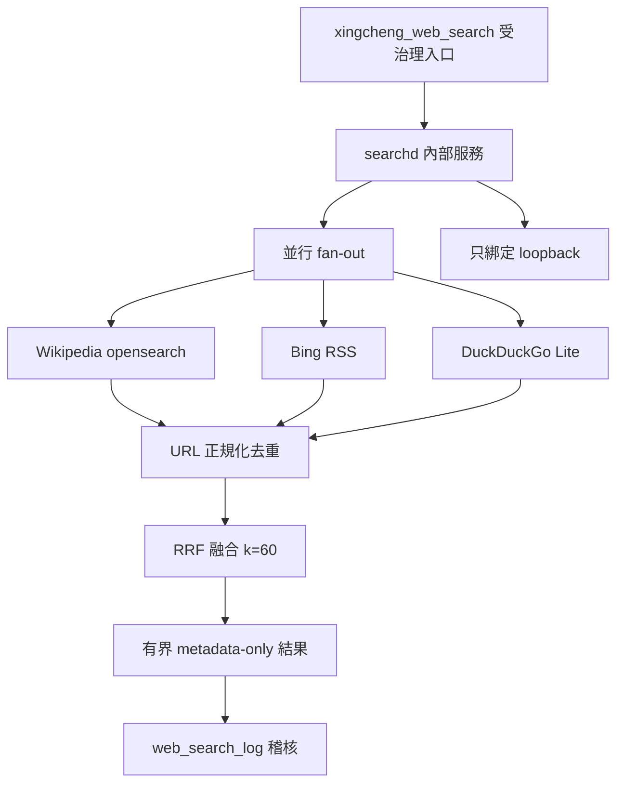

# 受管搜尋引擎（Go）完整架構圖

`searchd-go` 是內部服務（`internal-service`，按需啟動），契約為 `xingcheng-searchd/v1`（`Standalone tools/searchd-go/CONTRACT.md`）：對 Wikipedia opensearch、Bing RSS、DuckDuckGo Lite 做並行 fan-out，URL 正規化去重後以 reciprocal-rank fusion（k=60）排序，只回傳有界中繼資料。傳輸為 loopback HTTP/JSON（`127.0.0.1:8091`；`POST /v1/search`、`GET /healthz`），非 loopback listen 位址啟動即拒絕；出站目的地為編譯期 allowlist（`*.wikipedia.org`、`*.duckduckgo.com`、`bing.com`，含轉址），不得作為任意代理。

唯一進入點是受治理的 `xingcheng_web_search` 指令（稽核寫入 `web_search_log`）；供應鏈由 `runtime/settings/web-search.json` 驅動（`provider: searchd`，`auto_start` 延遲啟動 `searchd-go/bin/searchd.exe`）。

同步基線：A537、A538；逾時與空結果降級（`auto` 模式退回 SearXNG），一律 fail-closed。
