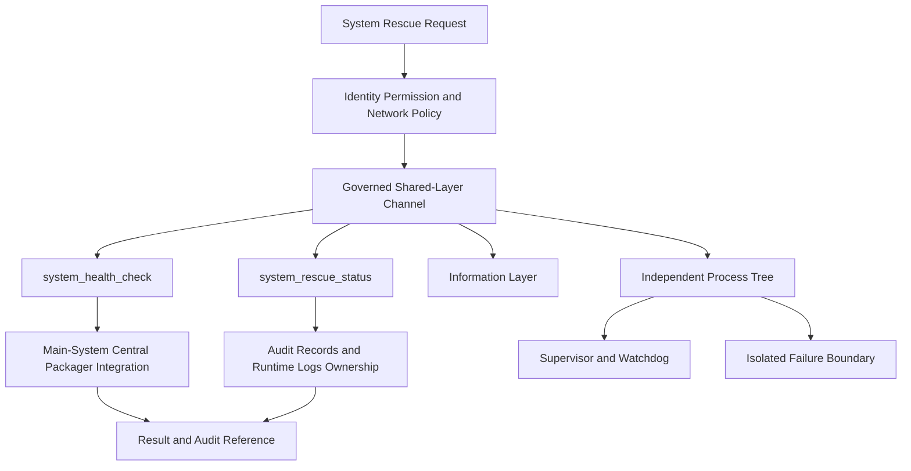

# System Rescue 完整架構圖

`system-rescue` 是稽核紀錄、執行期日誌與平台封裝整合的受治理執行者：封裝一律委派
main-system 中央封裝器（`main-system-central-packaging-only`），本工具不自行組裝產物。
權限為 `tool-root-only` 程式碼範圍與 `tool-database-only` 資料庫範圍，網路僅 loopback；
發行模式為 `special-unpackaged`，不進工具箱顯示（`hidden_from_toolbox`），由受治理路徑按需啟動。
指令失敗一律 fail-closed，未知指令回傳 `PERMISSION_DENIED`。

同步基線：A528、A537、A538、A540；獨立工具啟動與關閉各自上限 5 秒，逾時 fail-closed。
