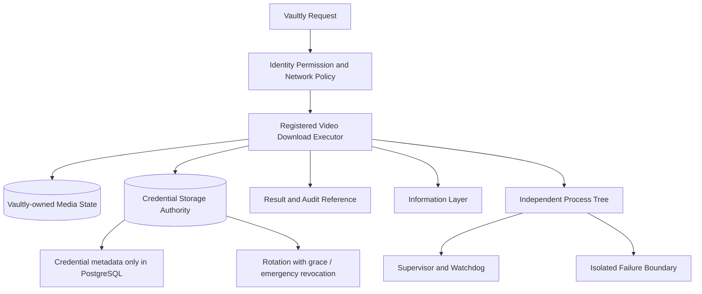

# Vaultly 完整架構圖

外部網路存取必須走受治理路徑；憑證與下載狀態不得跨工具暴露。

同步基線：A528、A537、A538、A540；獨立工具啟動與關閉各自上限 5 秒，逾時 fail-closed。

憑證存放於 PostgreSQL `gptbridge_security.credential`（migration `087_security_identity_control.sql`），只允許中繼資料並以 HMAC-SHA256 指紋識別；明文一律拒絕（`assert_metadata_only`）。輪替流程為 create → verify → switch → grace → revoke，並支援嚴格緊急撤銷（disable → terminate → rotate → 提升 generation → 稽核）；提升 generation 後，未跟上世代之敏感寫入 fail-closed。Vaultly 下載狀態與媒體屬自身域，不得跨工具暴露或作為他工具權威。
