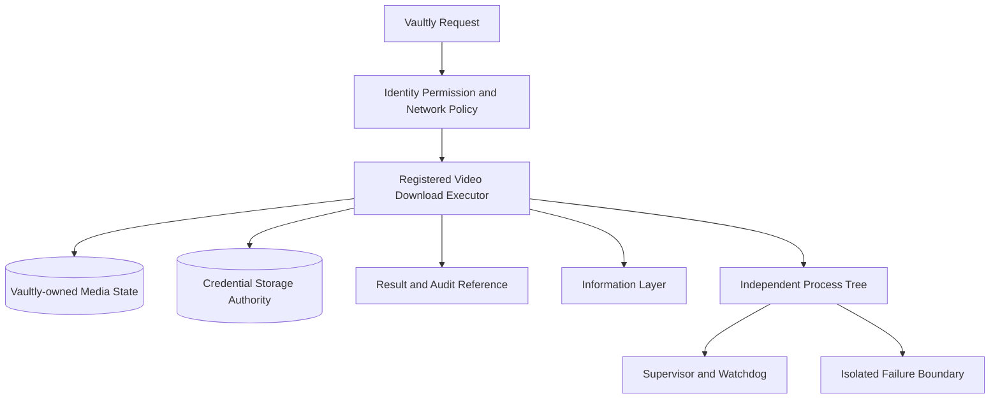

# Vaultly 完整架構圖

```mermaid
flowchart TB
  ENTRY[Vaultly Request] --> AUTH[Identity Permission and Network Policy]
  AUTH --> DOWNLOAD[Registered Video Download Executor]
  DOWNLOAD --> MEDIA[(Vaultly-owned Media State)]
  DOWNLOAD --> CRED[(Credential Storage Authority)]
  DOWNLOAD --> RECEIPT[Result and Audit Reference]
  DOWNLOAD --> INFO[Information Layer]
  DOWNLOAD --> PROC[Independent Process Tree]
  PROC --> SUP[Supervisor and Watchdog]
  PROC --> FAULT[Isolated Failure Boundary]
```

外部網路存取必須走受治理路徑；憑證與下載狀態不得跨工具暴露。

同步基線：A528、A537、A538、A540；獨立工具啟動與關閉各自上限 5 秒，逾時 fail-closed。
