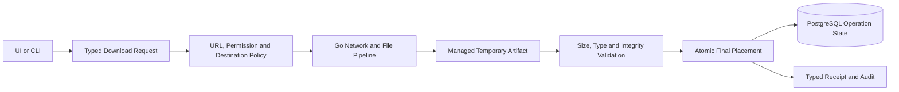

# Vaultly／影音下載自動化完整架構圖

```mermaid
flowchart LR
  UI[UI or CLI] --> REQUEST[Typed Download Request]
  REQUEST --> POLICY[URL, Permission and Destination Policy]
  POLICY --> GO[Go Network and File Pipeline]
  GO --> TEMP[Managed Temporary Artifact]
  TEMP --> VERIFY[Size, Type and Integrity Validation]
  VERIFY --> MOVE[Atomic Final Placement]
  MOVE --> PG[(PostgreSQL Operation State)]
  MOVE --> RECEIPT[Typed Receipt and Audit]
```

`vaultly` 是獨立工具。Go 負責有界網路、串流、分塊與檔案 I/O；下載前驗證目的地、來源、配額、檔案型別與空間，完成後驗證內容並原子移入正式位置。臨時檔、佇列、重試、頻寬、並行及保留期均須有界。不得下載未授權來源、執行下載內容、繞過網路政策或保存未登錄憑證。視窗關閉須在 5 秒內停止自身後端。
