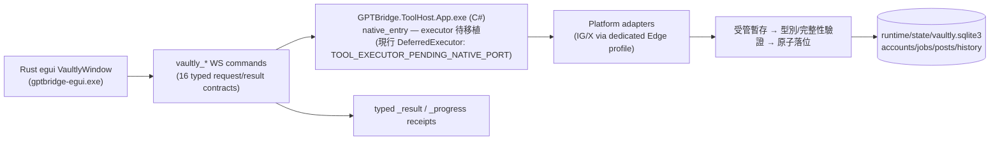

# Vaultly／影音下載自動化完整架構圖

```mermaid
flowchart LR
  UI["Rust egui VaultlyWindow<br/>(gptbridge-egui.exe)"] --> REQ["vaultly_* WS commands<br/>(16 typed request/result contracts)"]
  REQ --> HOST["GPTBridge.ToolHost.App.exe (C#)<br/>native_entry — executor 待移植<br/>(現行 DeferredExecutor: TOOL_EXECUTOR_PENDING_NATIVE_PORT)"]
  HOST --> ADAPT["Platform adapters<br/>(IG/X via dedicated Edge profile)"]
  ADAPT --> TEMP["受管暫存 → 型別/完整性驗證 → 原子落位"]
  TEMP --> SQLITE[("runtime/state/vaultly.sqlite3<br/>accounts/jobs/posts/history")]
  REQ --> RECEIPT["typed _result / _progress receipts"]
```

`vaultly` 是獨立工具（七大獨立工具名單之一，`main_system_independent_tool`）。**現況**：Python 實作已退役（B167/B38，55 檔 forbidden-source），native_entry `dist/GPTBridge.ToolHost.App.exe` 尚未建置 vaultly executor — 受管啟動目前 fail-closed（`LAUNCH_TARGET_MISSING`）。存活實作只有主系統內的 Rust egui 介面層（`tool_vaultly/`），16 個 `vaultly_*` 命令契約已在 codex 命令目錄登錄（`vaultly-<x>-request-v1`/`result-v1`，每命令綁 permission_action），等待 C# executor 實作。

設計面（契約與 README 規範）：社群媒體下載中心——專用 Edge profile（`runtime/browser-profiles/vaultly/shared`）承載 IG/X 會話；平台介面卡只允許登錄的 HTTPS 媒體域；不得繞過隱私/登入/DRM；直接影片須完整容器驗證；HLS 片段先合併音軌再落位；錯誤頁/部分回應/DASH init 永不存為影片；目的資料夾須預先存在；檔名＝帳號+時間戳；經下載歷史去重。目的地健康檢查（`destination_gate`）與條件集（media_types/keywords/dates/min_likes/min_views/`max_items_per_account`≤200/`skip_downloaded`）在 UI 層已具型別。

資料權威：工具狀態在 **`runtime/state/vaultly.sqlite3`**（SQLite：accounts/jobs/post_scan_jobs/posts/entity_history/filter_terms；bounded：jobs≤200、post_scan≤100、history≤20）——不是 PostgreSQL；PG 只承載 vaultly 的 codex/權限/稽核登錄。收據為通用 typed `_result`/`request_id` 框架與平台 outbox hub。

邊界：不得下載未登錄來源、不得執行下載內容、不取得網路政策例外、逐筆登錄收據。視窗關閉須在 5 秒內停止自身後端（B125；現行 `close_program_on_window_exit` 旗標已宣告、自動觸發接線待補）。
