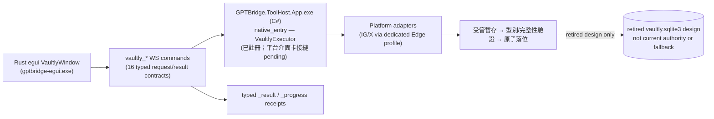

# Vaultly／影音下載自動化完整架構圖

```mermaid
flowchart LR
  UI["Rust egui VaultlyWindow<br/>(gptbridge-egui.exe)"] --> REQ["vaultly_* WS commands<br/>(16 typed request/result contracts)"]
  REQ --> HOST["GPTBridge.ToolHost.App.exe (C#)<br/>native_entry — VaultlyExecutor<br/>(已註冊；平台介面卡接縫 pending)"]
  HOST --> ADAPT["Platform adapters<br/>(IG/X via dedicated Edge profile)"]
  ADAPT --> TEMP["受管暫存 → 型別/完整性驗證 → 原子落位"]
  TEMP -. retired design only .-> SQLITE[("retired vaultly.sqlite3 design<br/>not current authority or fallback")]
  REQ --> RECEIPT["typed _result / _progress receipts"]
```

`vaultly` 是獨立工具（七大獨立工具名單之一，`main_system_independent_tool`）。**現況**：Python 實作已退役（B167/B38，55 檔 forbidden-source）；`VaultlyExecutor` 已註冊於通用 ToolHost，實作 16 個 `vaultly_*` 命令中的狀態面：state 快照、selection、filter terms、accounts 移除/還原、destination gate（真實檔案系統探測）、診斷報告匯出、job 建立/取消/重跑（destination 驗證 + `max_items_per_account`≤200 具真實約束）；作業狀態存於 owner-private `runtime/state/vaultly-state.json`。平台介面卡接縫（`vaultly_open_platform`/`vaultly_scan_following`/`vaultly_scan_posts`）維持 fail-closed `VAULTLY_PLATFORM_ADAPTER_PENDING`，直到 Edge profile 工作階段驅動有原生實作。存活實作：Rust egui 介面層（`tool_vaultly/`）+ C# executor；16 個命令契約在 codex 命令目錄登錄（`vaultly-<x>-request-v1`/`result-v1`，每命令綁 permission_action）。

設計面（契約與 README 規範）：社群媒體下載中心——專用 Edge profile（`runtime/browser-profiles/vaultly/shared`）承載 IG/X 會話；平台介面卡只允許登錄的 HTTPS 媒體域；不得繞過隱私/登入/DRM；直接影片須完整容器驗證；HLS 片段先合併音軌再落位；錯誤頁/部分回應/DASH init 永不存為影片；目的資料夾須預先存在；檔名＝帳號+時間戳；經下載歷史去重。目的地健康檢查（`destination_gate`）與條件集（media_types/keywords/dates/min_likes/min_views/`max_items_per_account`≤200/`skip_downloaded`）在 UI 層已具型別。

資料權威：PostgreSQL 是唯一正式結構化資料權威。`runtime/state/vaultly.sqlite3` 與 accounts/jobs/post_scan_jobs/posts/entity_history/filter_terms 僅記錄已退役設計，不是 current consumer、authority、fallback 或可啟用的持久化路徑。Vaultly 原生 executor 已註冊（`VaultlyExecutor`），但正式資料寫入與平台介面卡尚待移植／驗證；掃描類命令維持 `VAULTLY_PLATFORM_ADAPTER_PENDING` fail-closed；中央 codex／權限／稽核登錄不等於工具業務資料面已完成。收據為通用 typed `_result`/`request_id` 框架與平台 outbox hub。

邊界：不得下載未登錄來源、不得執行下載內容、不取得網路政策例外、逐筆登錄收據。視窗關閉須在 5 秒內停止自身後端（B125；現行 `close_program_on_window_exit` 旗標已宣告、自動觸發接線待補）。
