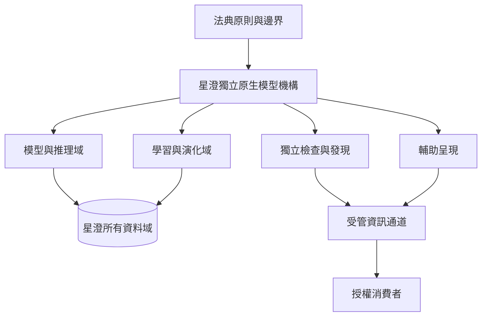

# 星澄架構唯讀鏡像

> 非規範性衍生文件。唯一權威仍為現行法典、正式登錄表與星澄所有域；本檔不得創設權限、固定實作或取代正式資料。

## 邊界摘要

- 星澄只有一個機構身分與一個所有域。
- 模型、學習、資料、檢查與輔助呈現均受同一權限、稽核、隔離及回滾原則約束。
- 跨域只傳遞最小授權結果或不透明引用，不移轉資料保管權。
- 具體語言、程序、路徑、格式、拓撲與數值配置由正式登錄表及所有者規則管理，不屬本鏡像的規範效力。
