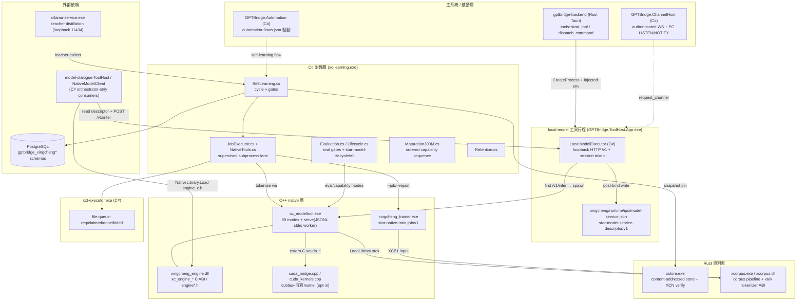

# 星澄／完整架構圖

> 規範性檢視檔。唯一權威仍為星澄法典、正式登錄表與權威資源；本檔不得創設規格、固定實作或取代權威來源。元件、路徑與邊界為現行實作的鏡像描述，若與現行權威衝突，以現行權威與正式登錄表為準。

## 行程拓撲

## 語言 lane 與權責

| Lane | 位置 | 權責 |
|---|---|---|
| C# 治理 | `src/backend/csharp/GPTBridge.XingchengLearning` → `xc-learning.exe` | 編排、政策閘門、DB、生命週期、稽核 |
| C++ native | `src/backend/cpp/` + `native_transformer/` | 模型核心、推論引擎、訓練器、模型工具 |
| Rust 資料面 | `src/backend/rust/xstore`、`xcorpus` | 不受信任輸入邊界：剖析、儲存、語料、tokenizer |
| C ABI | `xingcheng_engine_c.h`、`xtok_abi.h`、`xcuda_*` | 跨語言邊界，僅 ABI 不承載治理 |

## 二進位清單

| Binary | 語言 | 啟動方式 |
|---|---|---|
| `GPTBridge.ToolHost.App.exe` | C# | backend `CreateProcess` + injected env |
| `xc_modeltool.exe` | C++ | ToolHost 惰性 spawn（`serve --bundle`）或直接 CLI |
| `xingcheng_trainer.exe` | C++ | JobExecutor 受管子行程 / xct-executor |
| `xct-executor.exe` | C# | `serve` verb file-queue |
| `xc-learning.exe` | C# | CLI / AutomationCore flow |
| `xstore.exe` | Rust | 子行程（JSON-on-stdout） |
| `xcorpus.exe` / `.dll` | Rust | 子行程 / engine LoadLibrary |
| `xingcheng_engine*.dll` | C++ | NativeModelClient NativeLibrary.Load |

<!-- autogen:xingcheng-binaries -->
*autogen-scanner/v1 · generated 2026-10-02T04:15:13Z · 2106 files · main+devin+git+local-model+rag+ui*
| Binary | 語言 | 來源 |
|---|---|---|
| `%~dp0xingcheng_trainer.exe` | C++ | devin:Standalone tools/local-model/src/backend/services/xingcheng/infrastructure/native_transformer/training/_nfguard/build_devin.bat |
| `:gemm_bench.exe` | C++ | devin:Standalone tools/local-model/src/backend/services/xingcheng/infrastructure/native_transformer/training/_nfguard/runbench.bat |
| `:gemm_bench.exe` | C++ | git:Standalone tools/local-model/src/backend/services/xingcheng/infrastructure/native_transformer/training/_nfguard/runbench.bat |
| `:gemm_bench.exe` | C++ | local-model:Standalone tools/local-model/src/backend/services/xingcheng/infrastructure/native_transformer/training/_nfguard/runbench.bat |
| `:gemm_bench.exe` | C++ | main:Standalone tools/local-model/src/backend/services/xingcheng/infrastructure/native_transformer/training/_nfguard/runbench.bat |
| `:gemm_bench.exe` | C++ | rag:Standalone tools/local-model/src/backend/services/xingcheng/infrastructure/native_transformer/training/_nfguard/runbench.bat |
| `:gemm_bench.exe` | C++ | ui:Standalone tools/local-model/src/backend/services/xingcheng/infrastructure/native_transformer/training/_nfguard/runbench.bat |
| `InvestmentMobileShadow.exe` | C# | devin:native/test_suites/csharp_investment/InvestmentMobileShadow.csproj |
| `InvestmentMobileShadow.exe` | C# | git:native/test_suites/csharp_investment/InvestmentMobileShadow.csproj |
| `InvestmentMobileShadow.exe` | C# | local-model:native/test_suites/csharp_investment/InvestmentMobileShadow.csproj |
| `InvestmentMobileShadow.exe` | C# | main:native/test_suites/csharp_investment/InvestmentMobileShadow.csproj |
| `InvestmentMobileShadow.exe` | C# | rag:native/test_suites/csharp_investment/InvestmentMobileShadow.csproj |
| `InvestmentMobileShadow.exe` | C# | ui:native/test_suites/csharp_investment/InvestmentMobileShadow.csproj |
| `TestSuiteOrchestrator.exe` | C# | devin:native/test_suites/csharp/TestSuiteOrchestrator.csproj |
| `TestSuiteOrchestrator.exe` | C# | git:native/test_suites/csharp/TestSuiteOrchestrator.csproj |
| `TestSuiteOrchestrator.exe` | C# | local-model:native/test_suites/csharp/TestSuiteOrchestrator.csproj |
| `TestSuiteOrchestrator.exe` | C# | main:native/test_suites/csharp/TestSuiteOrchestrator.csproj |
| `TestSuiteOrchestrator.exe` | C# | rag:native/test_suites/csharp/TestSuiteOrchestrator.csproj |
| `TestSuiteOrchestrator.exe` | C# | ui:native/test_suites/csharp/TestSuiteOrchestrator.csproj |
| `xc-format.exe` | Rust | devin:Standalone tools/local-model/src/backend/rust/xc-format/Cargo.toml |
| `xc-format.exe` | Rust | main:Standalone tools/local-model/src/backend/rust/xc-format/Cargo.toml |
| `xc-learning.exe` | C# | devin:Standalone tools/local-model/src/backend/csharp/GPTBridge.XingchengLearning/GPTBridge.XingchengLearning.csproj |
| `xc-learning.exe` | C# | git:Standalone tools/local-model/src/backend/csharp/GPTBridge.XingchengLearning/GPTBridge.XingchengLearning.csproj |
| `xc-learning.exe` | C# | local-model:Standalone tools/local-model/src/backend/csharp/GPTBridge.XingchengLearning/GPTBridge.XingchengLearning.csproj |
| `xc-learning.exe` | C# | main:Standalone tools/local-model/src/backend/csharp/GPTBridge.XingchengLearning/GPTBridge.XingchengLearning.csproj |
| `xc-learning.exe` | C# | rag:Standalone tools/local-model/src/backend/csharp/GPTBridge.XingchengLearning/GPTBridge.XingchengLearning.csproj |
| `xc-learning.exe` | C# | ui:Standalone tools/local-model/src/backend/csharp/GPTBridge.XingchengLearning/GPTBridge.XingchengLearning.csproj |
| `xc-runtime-host.exe` | Rust | devin:Standalone tools/local-model/src/backend/rust/xc-runtime-host/Cargo.toml |
| `xc-runtime-host.exe` | Rust | main:Standalone tools/local-model/src/backend/rust/xc-runtime-host/Cargo.toml |
| `xcorpus.dll` | Rust | devin:Standalone tools/local-model/src/backend/rust/xcorpus/Cargo.toml |
| `xcorpus.exe` | Rust | devin:Standalone tools/local-model/src/backend/rust/xcorpus/Cargo.toml |
| `xct-executor.exe` | C# | devin:Standalone tools/local-model/src/backend/services/xingcheng/infrastructure/native_transformer/training/executor/XingchengTrainExecutor.csproj |
| `xct-executor.exe` | C# | git:Standalone tools/local-model/src/backend/services/xingcheng/infrastructure/native_transformer/training/executor/XingchengTrainExecutor.csproj |
| `xct-executor.exe` | C# | local-model:Standalone tools/local-model/src/backend/services/xingcheng/infrastructure/native_transformer/training/executor/XingchengTrainExecutor.csproj |
| `xct-executor.exe` | C# | main:Standalone tools/local-model/src/backend/services/xingcheng/infrastructure/native_transformer/training/executor/XingchengTrainExecutor.csproj |
| `xct-executor.exe` | C# | rag:Standalone tools/local-model/src/backend/services/xingcheng/infrastructure/native_transformer/training/executor/XingchengTrainExecutor.csproj |
| `xct-executor.exe` | C# | ui:Standalone tools/local-model/src/backend/services/xingcheng/infrastructure/native_transformer/training/executor/XingchengTrainExecutor.csproj |
| `xingcheng_trainer.exe` | C++ | devin:Standalone tools/local-model/src/backend/services/xingcheng/infrastructure/native_transformer/training/_nfguard/build_test.bat |
| `xingcheng_trainer.exe` | C++ | git:Standalone tools/local-model/src/backend/services/xingcheng/infrastructure/native_transformer/training/_nfguard/build_test.bat |
| `xingcheng_trainer.exe` | C++ | local-model:Standalone tools/local-model/src/backend/services/xingcheng/infrastructure/native_transformer/training/_nfguard/build_test.bat |
| `xingcheng_trainer.exe` | C++ | main:Standalone tools/local-model/src/backend/services/xingcheng/infrastructure/native_transformer/training/_nfguard/build_test.bat |
| `xingcheng_trainer.exe` | C++ | rag:Standalone tools/local-model/src/backend/services/xingcheng/infrastructure/native_transformer/training/_nfguard/build_test.bat |
| `xingcheng_trainer.exe` | C++ | ui:Standalone tools/local-model/src/backend/services/xingcheng/infrastructure/native_transformer/training/_nfguard/build_test.bat |
| `xstore.exe` | Rust | devin:Standalone tools/local-model/src/backend/rust/xstore/Cargo.toml |
<!-- /autogen:xingcheng-binaries -->

## 治理邊界

- 星澄 deny：`governance-rule`、`direct-database-write`、`main-program`、`other-tools`；manifest `direct_instruction: PERMISSION_DENIED`。
- 部署釘選：`runtime/settings/native-engine.json::checkpoint` → `serve --bundle`；未釘選 fail-closed（`XC_BUNDLE_CHECKPOINT_UNPINNED`）。
- 消費者政策：`csharp-orchestrator-client-only`；`/v1/infer` 需 session token；`request_channel` 走 ChannelHost。
- 全 lane fail-closed typed error codes（`EXECUTOR_*`、`KERNEL_POLICY_DENIED`、`MODE_NOT_REGISTERED`、`XC_*`）。
