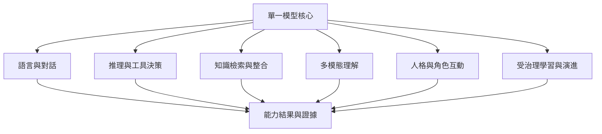

# 星澄能力唯讀鏡像

> 本圖是法典權威資料的唯讀衍生鏡像，不建立新規範、不授權實作，也不取代法典正文。

```mermaid
flowchart TD
    CORE[單一模型核心] --> LANGUAGE[語言與對話]
    CORE --> REASONING[推理與工具決策]
    CORE --> KNOWLEDGE[知識檢索與整合]
    CORE --> MULTIMODAL[多模態理解]
    CORE --> PERSONA[人格與角色互動]
    CORE --> LEARNING[受治理學習與演進]
    LANGUAGE --> RESULT[能力結果與證據]
    REASONING --> RESULT
    KNOWLEDGE --> RESULT
    MULTIMODAL --> RESULT
    PERSONA --> RESULT
    LEARNING --> RESULT
```

能力狀態、驗證結果與啟用資格仍以法典及其權威資料為準；本鏡像不表示任何能力已實作、通過或啟用。
