# 星澄／完整能力說明圖

> 規範性檢視檔。能力分類、實證與適用資格仍以法典及其權威資源為準；本圖為實作面的鏡像列舉，不表示任何能力已實證或通過發布閘門。

## 能力域總覽

```mermaid
flowchart LR
    ROOT["星澄能力域"]

    ROOT --> TRAIN["訓練"]
    ROOT --> INFER["推論/服務"]
    ROOT --> EVAL["評估/閘門"]
    ROOT --> GOV["治理/生命週期"]
    ROOT --> DATA["資料面"]
    ROOT --> HW["硬體/規模"]
    ROOT --> KERNEL["Kernel Registry"]

    TRAIN --> T1["task: pretrain | sft | dpo | grpo"]
    TRAIN --> T2["17 自我探針 probe-all<br/>smoke/gradcheck/maskcheck/headcheck/<br/>rulecheck/depthcheck/poscheck/inputcheck/<br/>gemmacheck/mixcheck/routecheck/dsvcheck/<br/>yarncheck/csacheck/mtpcheck/canoncheck/freezecheck"]
    TRAIN --> T3["canonical-materialize<br/>star-canonical-effective/v1"]
    TRAIN --> T4["model families:<br/>DeltaNet hybrid / GQA / MLA / CSA2 /<br/>MoE(sigmoid+shared+auxfree) / MTP+stack /<br/>Gemma4 / vision early-fusion / YaRN"]

    INFER --> I1["serve line-protocol:<br/>status/load/unload/infer/think/memplan/<br/>depth/moe-analyze/fim/state-save|restore/<br/>prefix-scope|invalidate/prefill/decode-artifact"]
    INFER --> I2["sampling profiles:<br/>precise/balanced/creative/roleplay/story/brainstorm"]
    INFER --> I3["prefix cache / KV int8 / delta-state<br/>CUDA opt-in (bf16/fp8/kv/graph)"]
    INFER --> I4["bundle I/O: import/export-bundle,<br/>quant none|int8|int4|bf16"]

    EVAL --> E1["eval: perplexity+TPS+generation gate<br/>(baseline regression compare)"]
    EVAL --> E2["capability: 10 categories<br/>zh-TW/en/math/code/reading/multi_turn/<br/>context_tracking/instruction/tool_call_format/<br/>expert_routing"]
    EVAL --> E3["maturity ladder L0–L7<br/>structure→fwd/bwd→overfit→pretrain→<br/>generation→dialogue→reasoning→controlled_evolution"]
    EVAL --> E4["probes: parity/precision/bf16-cert/quant-cert/<br/>cache/kv-gather/state-drift/mtp-*/system1-bench"]
    EVAL --> E5["maturation 300M: 11 ordered capabilities +<br/>regression matrix + phase lock"]

    GOV --> G1["self-learning cycle<br/>collect→snapshot→queue→train→eval→<br/>stage/activate→pin→prune"]
    GOV --> G2["lifecycle star-model-lifecycle/v1<br/>+ governed rollback + succession"]
    GOV --> G3["failure pool 15 classes<br/>OPEN/TRAINED/RESOLVED/REGRESSED"]
    GOV --> G4["recovery lane<br/>single-capability staged SFT"]
    GOV --> G5["retention sweep<br/>(lifecycle-pinned fail-closed kept)"]
    GOV --> G6["audit chain (PG + JSONL)<br/>provenance/binary-provenance"]
    GOV --> G7["release-gate / converge-check<br/>~30 ordered steps"]

    DATA --> D1["xcorpus corpus:<br/>registry gate→scan→dedup(MinHash)→<br/>pack→manifest"]
    DATA --> D2["xstore: ckpt-*/put/get/verify-store/<br/>snapshot/audit-*/fail-*"]
    DATA --> D3["PG schemas + role DB collectors"]
    DATA --> D4["teacher-collect distillation"]

    HW --> H1["hw-caps / hw-baseline / probe-cuda"]
    HW --> H2["expert-residency / offload-bench /<br/>expert-store (XEB1)"]
    HW --> H3["scale/low-resource-sim / pd-pipeline /<br/>memory-plan / memplane"]
    HW --> H4["resource governor quota<br/>(8 classes, training shed-first)"]

    KERNEL --> K1["star-kernel-registry<br/>trainer 32 / engine 19 / xstore 11 / xcorpus 8"]
    KERNEL --> K2["star-kernel-policy<br/>deny_variants/deny_kernels/force_serial/<br/>max_threads — fail-closed"]
```

## xc_modeltool 模式面（89 modes + mode-registry）

| 類別 | 模式 |
|---|---|
| MODEL | tokenize, import-bundle, export-bundle, serve, mtp-runtime, ckpt-converge |
| TRAINING | corpus, distill-init, parameter-freeze-probe, sparse-optimizer-probe |
| EVAL | eval, capability, vision-smoke, spec-probe, vision-budget, depth-probe, system1-head, system1-bench, mtp-speedup, mtp-draft-probe, npu-*-bench, native-thinking-eval, spec-verify |
| CACHE | cache-smoke, context-probe, reuse-probe, hybrid-prefix-smoke, prefix-invalidation, delta-prefix-restore, sparse-probe, kv-gather-probe |
| PRECISION | parity, precision, precision-parity, delta-precision-probe, cpu-bf16-bench, bf16-cert, bf16-drift, quant-cert, blockwise-quant-probe, mtp-precision-parity |
| STATE | memplan, memory-plan, statebench, state-bench, state-snapshot, state-drift, state2-smoke, sched-smoke, memplane-probe, memplane-telemetry |
| CUDA | probe-cuda, decode-graph-parity, cuda-parity-all |
| EXPERT | moe-analyze, router-analyze, expert-residency, expert-offload-bench, expert-quant-parity, expert-store-build/read, prefetch-probe, shared-routed-isolation, expert-granularity-probe |
| SCALE | pd-pipeline-bench, pd-transfer-smoke, scale-metrics, low-resource-sim, scale-sim, scale-status, future-scale-probe, npu-*, cpu-affinity-probe, system-reuse-probe, capacity-metrics, hw-baseline, hw-caps, param-reuse-probe, kernel-registry |
| RAG | rag-prefix-bench |
| PROVENANCE | provenance-check, single-runtime-owner, artifact-dedup |

## xc-learning.exe 能力面（~100 verbs）

| 面 | 代表 verbs |
|---|---|
| 循環/任務 | `--run-once [--force]`, `--run-jobs`, `--job`, `--queue-job`, `--status`, `--enable/--disable`, `--self-test`, `--retention`, `--corpus`, `--schedule` |
| 成熟序列 | `--maturation-status/-freeze/-reopen/-unsupported/-complete/-baseline`, `--thinking-compare`, `--gen-*` |
| 發布/收斂 | `--release-gate`, `--converge-check`, `--axis/system1/community/capacity/maturity/cuda-plane/silicon-checks`, `--langcheck`, `--verify-audit`, `--db-status`, `--migrate` |
| 追蹤/目錄 | `--trace-*`, `--catalog-*`, `--caps-*`, `--provenance-*`, `--binary-provenance`, `--mutation-lease-*` |
| 恢復迴圈 | `--self-training-*`, `--failure-*`, `--recovery-*`, `--dataset-purity-check` |
| 長程任務 | `--task-create/-plan/-step/-checkpoint/-compact/-resume/-revalidate/-transition/-status` |
| RAG/個性 | `--graph-*`, `--grounded-*`, `--rag-*`, `--persona-*`, `--refusal-*`, `--roleplay-*`, `--memory-*` |
| 規模/效率 | `--scale-*`, `--eff-*`, `--depth-*`, `--capacity-*`, `--quantization-validate`, `--expert-*` |
| 訓練加速 | `--training-*`, `--bottleneck-classify`, `--batch-plan`, `--sequence-buckets`, `--speed-gate`, `--distill-*` |
| 工具契約 | `--tool-validate/-gate/-metrics`, `--tool-call-validate`, `--structured-validate` |

## 閘門階梯

- **能力套件**：10 類別，任一類別 pass_rate 相對 baseline 下降即 fail（exit 2）。
- **困惑度/TPS 閘門**：`max_perplexity_regression_pct`、`min_tokens_per_second`、`min_tps_baseline_ratio`。
- **成熟度階梯 L0–L7**：僅執行過的測試決定等級；首個 fail/skipped 封頂。
- **300M 成熟序列**：11 項有序能力（instruction_following→…→vision），單一 active、freeze-after-gate、回歸矩陣含 system1 + runtime 七面。
- **失敗池**：15 類別 OPEN/TRAINED/RESOLVED/REGRESSED，4096 上限，C# 與 Rust 互通格式。
