# 星澄／完整能力說明圖

> 規範性檢視檔。能力分類、實證與適用資格仍以法典及其權威資源為準；本圖為實作面的鏡像列舉，不表示任何能力已實證或通過發布閘門。

## 能力域總覽

```mermaid
flowchart LR
    ROOT["星澄能力域"]

    ROOT --> TRAIN["訓練"]
    ROOT --> INFER["推論/服務"]
    ROOT --> EVAL["評估/閘門"]
    ROOT --> GOV["治理/生命週期"]
    ROOT --> DATA["資料面"]
    ROOT --> HW["硬體/規模"]
    ROOT --> KERNEL["Kernel Registry"]

    TRAIN --> T1["task: pretrain | sft | dpo | grpo"]
    TRAIN --> T2["17 自我探針 probe-all<br/>smoke/gradcheck/maskcheck/headcheck/<br/>rulecheck/depthcheck/poscheck/inputcheck/<br/>gemmacheck/mixcheck/routecheck/dsvcheck/<br/>yarncheck/csacheck/mtpcheck/canoncheck/freezecheck"]
    TRAIN --> T3["canonical-materialize<br/>star-canonical-effective/v1"]
    TRAIN --> T4["model families:<br/>DeltaNet hybrid / GQA / MLA / CSA2 /<br/>MoE(sigmoid+shared+auxfree) / MTP+stack /<br/>Gemma4 / vision early-fusion / YaRN"]

    INFER --> I1["serve line-protocol:<br/>status/load/unload/infer/think/memplan/<br/>depth/moe-analyze/fim/state-save|restore/<br/>prefix-scope|invalidate/prefill/decode-artifact"]
    INFER --> I2["sampling profiles:<br/>precise/balanced/creative/roleplay/story/brainstorm"]
    INFER --> I3["prefix cache / KV int8 / delta-state<br/>CUDA opt-in (bf16/fp8/kv/graph)"]
    INFER --> I4["bundle I/O: import/export-bundle,<br/>quant none|int8|int4|bf16"]

    EVAL --> E1["eval: perplexity+TPS+generation gate<br/>(baseline regression compare)"]
    EVAL --> E2["capability: 10 categories<br/>zh-TW/en/math/code/reading/multi_turn/<br/>context_tracking/instruction/tool_call_format/<br/>expert_routing"]
    EVAL --> E3["maturity ladder L0–L7<br/>structure→fwd/bwd→overfit→pretrain→<br/>generation→dialogue→reasoning→controlled_evolution"]
    EVAL --> E4["probes: parity/precision/bf16-cert/quant-cert/<br/>cache/kv-gather/state-drift/mtp-*/system1-bench"]
    EVAL --> E5["maturation 300M: 11 ordered capabilities +<br/>regression matrix + phase lock"]

    GOV --> G1["self-learning cycle<br/>collect→snapshot→queue→train→eval→<br/>stage/activate→pin→prune"]
    GOV --> G2["lifecycle star-model-lifecycle/v1<br/>+ governed rollback + succession"]
    GOV --> G3["failure pool 15 classes<br/>OPEN/TRAINED/RESOLVED/REGRESSED"]
    GOV --> G4["recovery lane<br/>single-capability staged SFT"]
    GOV --> G5["retention sweep<br/>(lifecycle-pinned fail-closed kept)"]
    GOV --> G6["audit chain (PG + JSONL)<br/>provenance/binary-provenance"]
    GOV --> G7["release-gate / converge-check<br/>~30 ordered steps"]

    DATA --> D1["xcorpus corpus:<br/>registry gate→scan→dedup(MinHash)→<br/>pack→manifest"]
    DATA --> D2["xstore: ckpt-*/put/get/verify-store/<br/>snapshot/audit-*/fail-*"]
    DATA --> D3["PG schemas + role DB collectors"]
    DATA --> D4["teacher-collect distillation"]

    HW --> H1["hw-caps / hw-baseline / probe-cuda"]
    HW --> H2["expert-residency / offload-bench /<br/>expert-store (XEB1)"]
    HW --> H3["scale/low-resource-sim / pd-pipeline /<br/>memory-plan / memplane"]
    HW --> H4["resource governor quota<br/>(8 classes, training shed-first)"]

    KERNEL --> K1["star-kernel-registry<br/>trainer 32 / engine 19 / xstore 11 / xcorpus 8"]
    KERNEL --> K2["star-kernel-policy<br/>deny_variants/deny_kernels/force_serial/<br/>max_threads/dev_min_flops/vram_reserve_mb — fail-closed"]
    KERNEL --> K3["star-accel-plane<br/>單一動態加速器：CPU lanes + CUDA device<br/>+ RAM/VRAM live 准入（trainer --accel-plane /<br/>modeltool accel-plane）"]
```

### Kernel Registry（autogen）

<!-- autogen:xingcheng-kernels -->
*autogen-scanner/v1 · 2340 files · main+devin+git+local-model+rag+ui*
| lane | kernels | 來源 |
|---|---|---|
| trainer | 97 | main:xingcheng/src/backend/services/xingcheng/infrastructure/native_transformer/training/xct_kernels.h |
| trainer | 97 | devin:xingcheng/src/backend/services/xingcheng/infrastructure/native_transformer/training/xct_kernels.h |
| trainer | 97 | git:xingcheng/src/backend/services/xingcheng/infrastructure/native_transformer/training/xct_kernels.h |
| trainer | 97 | local-model:xingcheng/src/backend/services/xingcheng/infrastructure/native_transformer/training/xct_kernels.h |
| trainer | 97 | rag:xingcheng/src/backend/services/xingcheng/infrastructure/native_transformer/training/xct_kernels.h |
| trainer | 97 | ui:xingcheng/src/backend/services/xingcheng/infrastructure/native_transformer/training/xct_kernels.h |
| xcorpus | 8 | main:xingcheng/src/backend/rust/xcorpus/src/kernels.rs |
| xcorpus | 8 | devin:xingcheng/src/backend/rust/xcorpus/src/kernels.rs |
| xcorpus | 8 | git:xingcheng/src/backend/rust/xcorpus/src/kernels.rs |
| xcorpus | 8 | local-model:xingcheng/src/backend/rust/xcorpus/src/kernels.rs |
| xcorpus | 8 | rag:xingcheng/src/backend/rust/xcorpus/src/kernels.rs |
| xcorpus | 8 | ui:xingcheng/src/backend/rust/xcorpus/src/kernels.rs |
| xstore | 11 | main:xingcheng/src/backend/rust/xstore/src/kernels.rs |
| xstore | 11 | devin:xingcheng/src/backend/rust/xstore/src/kernels.rs |
| xstore | 11 | git:xingcheng/src/backend/rust/xstore/src/kernels.rs |
| xstore | 11 | local-model:xingcheng/src/backend/rust/xstore/src/kernels.rs |
| xstore | 11 | rag:xingcheng/src/backend/rust/xstore/src/kernels.rs |
| xstore | 11 | ui:xingcheng/src/backend/rust/xstore/src/kernels.rs |
<!-- /autogen:xingcheng-kernels -->

## xc_modeltool 模式面（91 modes + mode-registry）

<!-- autogen:xingcheng-modes -->
*autogen-scanner/v1 · 2340 files · main+devin+git+local-model+rag+ui*
| 類別 | 模式 |
|---|---|
| CACHE | `cache-smoke`, `context-probe`, `reuse-probe`, `hybrid-prefix-smoke`, `prefix-invalidation`, `delta-prefix-restore`, `sparse-probe`, `kv-gather-probe` |
| CUDA | `probe-cuda`, `decode-graph-parity`, `cuda-parity-all`, `compute-plane`, `accel-plane` |
| EVAL | `eval`, `capability`, `vision-smoke`, `spec-probe`, `vision-budget`, `depth-probe`, `system1-head`, `system1-bench`, `mtp-speedup`, `mtp-draft-probe`, `npu-system1-bench`, `npu-embedding-bench`, `npu-prefill-bench`, `native-thinking-eval`, `spec-verify` |
| EXPERT | `moe-analyze`, `expert-residency`, `expert-offload-bench`, `expert-quant-parity`, `expert-store-build`, `expert-store-read`, `prefetch-probe`, `shared-routed-isolation`, `expert-granularity-probe`, `router-analyze` |
| MODEL | `tokenize`, `import-bundle`, `export-bundle`, `serve`, `mtp-runtime`, `ckpt-converge` |
| PRECISION | `parity`, `precision`, `delta-precision-probe`, `mtp-precision-parity`, `cpu-bf16-bench`, `bf16-cert`, `bf16-drift`, `quant-cert`, `blockwise-quant-probe`, `precision-parity` |
| PROVENANCE | `provenance-check`, `single-runtime-owner`, `artifact-dedup` |
| RAG | `rag-prefix-bench` |
| SCALE | `pd-pipeline-bench`, `pd-transfer-smoke`, `scale-metrics`, `low-resource-sim`, `scale-sim`, `scale-status`, `future-scale-probe`, `npu-discovery`, `cpu-affinity-probe`, `system-reuse-probe`, `parameter-efficiency-report`, `silicon-routing-bench`, `npu-ep-enum`, `npu-duplicate-cost`, `capacity-metrics`, `hw-baseline`, `param-reuse-probe`, `hw-caps`, `kernel-registry` |
| STATE | `memplan`, `statebench`, `memplane-probe`, `memplane-telemetry`, `memory-plan`, `state-snapshot`, `state-bench`, `state-drift`, `state2-smoke`, `sched-smoke` |
| TRAINING | `corpus`, `distill-init`, `parameter-freeze-probe`, `sparse-optimizer-probe` |

（count=91）
<!-- /autogen:xingcheng-modes -->

| 類別 | 模式 |
|---|---|
| MODEL | tokenize, import-bundle, export-bundle, serve, mtp-runtime, ckpt-converge |
| TRAINING | corpus, distill-init, parameter-freeze-probe, sparse-optimizer-probe |
| EVAL | eval, capability, vision-smoke, spec-probe, vision-budget, depth-probe, system1-head, system1-bench, mtp-speedup, mtp-draft-probe, npu-*-bench, native-thinking-eval, spec-verify |
| CACHE | cache-smoke, context-probe, reuse-probe, hybrid-prefix-smoke, prefix-invalidation, delta-prefix-restore, sparse-probe, kv-gather-probe |
| PRECISION | parity, precision, precision-parity, delta-precision-probe, cpu-bf16-bench, bf16-cert, bf16-drift, quant-cert, blockwise-quant-probe, mtp-precision-parity |
| STATE | memplan, memory-plan, statebench, state-bench, state-snapshot, state-drift, state2-smoke, sched-smoke, memplane-probe, memplane-telemetry |
| CUDA | probe-cuda, decode-graph-parity, cuda-parity-all, compute-plane, accel-plane |
| EXPERT | moe-analyze, router-analyze, expert-residency, expert-offload-bench, expert-quant-parity, expert-store-build/read, prefetch-probe, shared-routed-isolation, expert-granularity-probe |
| SCALE | pd-pipeline-bench, pd-transfer-smoke, scale-metrics, low-resource-sim, scale-sim, scale-status, future-scale-probe, npu-*, cpu-affinity-probe, system-reuse-probe, capacity-metrics, hw-baseline, hw-caps, param-reuse-probe, kernel-registry |
| RAG | rag-prefix-bench |
| PROVENANCE | provenance-check, single-runtime-owner, artifact-dedup |

## xc-learning.exe 能力面（~100 verbs）

<!-- autogen:xingcheng-verbs -->
*autogen-scanner/v1 · 2340 files · main+devin+git+local-model+rag+ui*
| verbs |
|---|
| `--active-compute-gate` `--adaptive-embedding` `--apply` `--arch-gate` `--arch-hash` `--architecture` `--artifact-register` `--axis-checks` `--baseline` `--baseline-off` `--bin-dir` `--binary-provenance` `--bottleneck-classify` `--boundary-check` `--budget` `--build` `--bundle` `--bundle-hash` `--call` `--cancel-job` `--candidate` `--candidate-off` `--candidate-on` `--cap-record` `--capabilities-resolve` `--capability` `--capability-floor-gate` `--capacity-ceiling` `--capacity-checks` `--capacity-kpis` `--capacity-proof` `--capacity-validate` `--caps-status` `--caps-validate` `--catalog-emit` `--catalog-validate` `--certification-gate` `--chat` `--checkpoint` `--checkpoint-hash` `--citation-metrics` `--code-task-validate` `--cognition-route` `--common` `--common-floor-gate` `--community-checks` `--config` `--confirmed` `--conflict-resolve` `--constraints` `--converge-check` `--core-contract` `--corpus` `--correction-validate` `--cost` `--count` `--cpu-plan` `--creative-profile` `--cuda-language-check` `--cuda-language-policy` `--cuda-plane-checks` `--cuda-training-plane` `--curriculum-stage-check` `--curriculum-stage-policy` `--data-order-probe` `--data-quality` `--dataset-purity-check` `--dataset-quality` `--db-status` `--decision-calibrate` `--decision-metrics` `--decision-trace` `--depth-efficiency` `--depth-inheritance-validate` `--depth-plan` `--depth-scale-probe` `--disable` `--distill-artifact-validate` `--distillation-contract` `--domain` `--done` `--drift-gate` `--dry-run` `--edge` `--eff-policy` `--eff-tier-plan` `--effective-compute` `--effective-policy` `--enable` `--eval-file` `--eval-result` `--eval-result-validate` `--eval-status` `--eval-suites` `--eval-tier-policy` `--evaluate` `--event` `--evidence` `--evidence-cache` `--expert-granularity-compare` `--expert-lifecycle-gate` `--expert-lineage` `--expert-residency-plan` `--expert-scale-validate` `--expert-specialization` `--factuality` `--failure-classify-check` `--failure-pool-status` `--failure-record` `--feature-catalog` `--file` `--fim` `--fim-validate` `--force` `--freeze-map-validate` `--fused-adamw-status` `--gen-begin` `--gen-certify` `--gen-promote` `--gen-purge` `--gen-record` `--gen-status` `--generation` `--goal` `--golden-gate` `--graph` `--graph-add-edge` `--graph-add-node` `--graph-key-validate` `--graph-query` `--grounded-v2-validate` `--grounded-validate` `--grounding-gate` `--groupwise-eval` `--hardware-scale-search` `--harness-outcome` `--harness-register` `--harness-validate` `--heads` `--hidden` `--id` `--include-collected` `--injection-guard` `--interval-s` `--job` `--job-hash` `--job-id` `--key` `--kind` `--kv-heads` `--langcheck` `--language-scan` `--layers` `--lifetime-plan` `--lineage` `--live-cycle` `--manifest` `--maturation-baseline` `--maturation-complete` `--maturation-freeze` `--maturation-reopen` `--maturation-status` `--maturation-unsupported` `--maturity-baseline` `--maturity-checks` `--maturity-promotion` `--maturity-registry` `--max-level` `--memory-isolation` `--memory-read` `--memory-write` `--memplane-telemetry-validate` `--migrate` `--migrated` `--min-quality` `--modality-validate` `--mode` `--model-identity` `--model-maturity` `--model-maturity-status` `--model-merge` `--model-version` `--module-sensitivity` `--mutation` `--mutation-lease-abort` `--mutation-lease-acquire` `--mutation-lease-commit` `--mutation-lease-status` `--namespace` `--needed` `--no-builds` `--no-repair` `--node` `--note` `--notes` `--older-than-s` `--out` `--outcome-status` `--output` `--owner` `--param-efficiency` `--path` `--persona-get` `--persona-validate` `--plan` `--precision-policy` `--prefill-chunk` `--preflight` `--preset` `--probs` `--profile` `--promotion-gate` `--provenance` `--provenance-check` `--provenance-compute` `--provenance-verify` `--quantization-validate` `--queue-job` `--rag-decide` `--rag-prefix-manifest` `--reap-stale` `--reason` `--reasoning-compression` `--record` `--recovery-dataset-build` `--recovery-eval` `--recovery-run` `--refusal-decide` `--refusal-eval` `--rejected` `--release-gate` `--repair` `--request` `--requirement` `--residency-plan` `--result` `--retention` `--retention-gate` `--retrieval-compression-gate` `--retrieval-efficiency` `--reward-gate` `--roleplay-compact` `--roleplay-create` `--roleplay-eval` `--roleplay-event` `--root` `--route-mode` `--router-stability` `--routing-aggregate` `--routing-record` `--routing-status` `--rows` `--run` `--run-jobs` `--run-once` `--runtime` `--runtime-hash` `--runtime-host-acquire` `--save` `--scale-hardware-gate` `--scale-precision-map` `--scale-profile-seed` `--scale-profile-validate` `--scale-promotion-gate` `--scale-resource-cert` `--scale-scorecard` `--scale-tier-validate` `--scale-tiers` `--schedule` `--schema` `--schema-from` `--schema-invalid` `--schema-to` `--seed` `--self-test` `--self-train-trigger` `--self-training-admit` `--self-training-circuit` `--self-training-contract` `--self-training-receipt` `--sequence-buckets` `--sequence-check` `--session` `--shared` `--silicon-checks` `--silicon-route` `--source` `--source-ckpt-sha256` `--speed-gate` `--stage` `--state` `--status` `--steer` `--step` `--steps` `--structured-validate` `--style` `--style-profile` `--subject` `--suite` `--summary` `--system1-checks` `--target` `--task` `--task-checkpoint` `--task-compact` `--task-create` `--task-plan` `--task-resume` `--task-revalidate` `--task-status` `--task-step` `--task-transition` `--taxonomy` `--teacher-collect` `--teacher-validate` `--text` `--thinking-compare` `--thinking-levels` `--time-to-quality` `--to` `--tokenizer` `--tool` `--tool-call-validate` `--tool-gate` `--tool-metrics` `--tool-result` `--tool-result-validate` `--tool-root` `--tool-validate` `--tools` `--total-ceiling` `--trace` `--trace-record` `--trace-status` `--trainable-budget` `--training-batch-plan` `--training-mixture` `--training-pilot` `--training-precision-map` `--training-precision-policy` `--training-repro` `--training-run-receipt` `--training-telemetry-validate` `--trajectory-validate` `--transformed` `--two-stage-retrieval` `--typed-decision-validate` `--val-permille` `--vector-tier-policy` `--verify-audit` `--version-dimensions` `--weight-method` `--weights` `--weights-sha256` `--xcn` |

（count=356）
<!-- /autogen:xingcheng-verbs -->

| 面 | 代表 verbs |
|---|---|
| 循環/任務 | `--run-once [--force]`, `--run-jobs`, `--job`, `--queue-job`, `--status`, `--enable/--disable`, `--self-test`, `--retention`, `--corpus`, `--schedule` |
| 成熟序列 | `--maturation-status/-freeze/-reopen/-unsupported/-complete/-baseline`, `--thinking-compare`, `--gen-*` |
| 發布/收斂 | `--release-gate`, `--converge-check`, `--axis/system1/community/capacity/maturity/cuda-plane/silicon-checks`, `--langcheck`, `--verify-audit`, `--db-status`, `--migrate` |
| 追蹤/目錄 | `--trace-*`, `--catalog-*`, `--caps-*`, `--provenance-*`, `--binary-provenance`, `--mutation-lease-*` |
| 恢復迴圈 | `--self-training-*`, `--failure-*`, `--recovery-*`, `--dataset-purity-check` |
| 長程任務 | `--task-create/-plan/-step/-checkpoint/-compact/-resume/-revalidate/-transition/-status` |
| RAG/個性 | `--graph-*`, `--grounded-*`, `--rag-*`, `--persona-*`, `--refusal-*`, `--roleplay-*`, `--memory-*` |
| 規模/效率 | `--scale-*`, `--eff-*`, `--depth-*`, `--capacity-*`, `--quantization-validate`, `--expert-*` |
| 訓練加速 | `--training-*`, `--bottleneck-classify`, `--batch-plan`, `--sequence-buckets`, `--speed-gate`, `--distill-*` |
| 工具契約 | `--tool-validate/-gate/-metrics`, `--tool-call-validate`, `--structured-validate` |

## 閘門階梯

- **能力套件**：10 類別，任一類別 pass_rate 相對 baseline 下降即 fail（exit 2）。
- **困惑度/TPS 閘門**：`max_perplexity_regression_pct`、`min_tokens_per_second`、`min_tps_baseline_ratio`。
- **成熟度階梯 L0–L7**：僅執行過的測試決定等級；首個 fail/skipped 封頂。
- **300M 成熟序列**：11 項有序能力（instruction_following→…→vision），單一 active、freeze-after-gate、回歸矩陣含 system1 + runtime 七面。
- **失敗池**：15 類別 OPEN/TRAINED/RESOLVED/REGRESSED，4096 上限，C# 與 Rust 互通格式。
