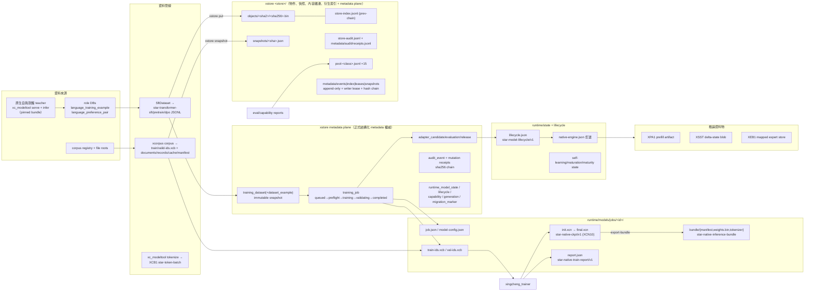

# 星澄／完整資料圖

> 規範性檢視檔。本檔只鏡像資料格式、權責與流向，不複製任何權威資料內容。格式 tag、schema 與欄位以權威源（xstore/CONTRACT.md、xcb.rs、xcn1.rs、Repository.cs、Policy.cs）為準。

## 資料流總覽



## 二進位容器家族

<!-- autogen:xingcheng-containers -->
*autogen-scanner/v1 · 3072 files · main+codex-metadata-closure+devin+git+local-model+rag+ui*
| Magic | 定義/引用來源 |
|---|---|
| `XCB1` | codex-metadata-closure:xingcheng/contracts/xnc/vectors/manifest.json, codex-metadata-closure:xingcheng/src/backend/cpp/src/xcb_batch.h, codex-metadata-closure:xingcheng/src/backend/rust/xcorpus/src/xcb.rs, devin:xingcheng/contracts/xnc/vectors/manifest.json (+17) |
| `XCN1` | codex-metadata-closure:xingcheng/contracts/xnc/vectors/manifest.json, codex-metadata-closure:xingcheng/src/backend/rust/xc-format/src/lib.rs, codex-metadata-closure:xingcheng/src/backend/rust/xstore/src/xcn1.rs, codex-metadata-closure:xingcheng/src/backend/services/xingcheng/infrastructure/native_transformer/tools/xcm_rtgates.h (+31) |
| `XEB1` | codex-metadata-closure:xingcheng/src/backend/services/xingcheng/infrastructure/native_transformer/tools/xcm_scale.h, devin:xingcheng/src/backend/services/xingcheng/infrastructure/native_transformer/tools/xcm_scale.h, git:xingcheng/src/backend/services/xingcheng/infrastructure/native_transformer/tools/xcm_scale.h, local-model:xingcheng/src/backend/services/xingcheng/infrastructure/native_transformer/tools/xcm_scale.h (+3) |
| `XPA1` | codex-metadata-closure:xingcheng/src/backend/cpp/src/engine_generate.h, devin:xingcheng/src/backend/cpp/src/engine_generate.h, git:xingcheng/src/backend/cpp/src/engine_generate.h, local-model:xingcheng/src/backend/cpp/src/engine_generate.h (+3) |
| `XSST` | codex-metadata-closure:xingcheng/src/backend/cpp/src/engine_generate.h, codex-metadata-closure:xingcheng/src/backend/services/xingcheng/infrastructure/native_transformer/tools/xcm_scale.h, devin:xingcheng/src/backend/cpp/src/engine_generate.h, devin:xingcheng/src/backend/services/xingcheng/infrastructure/native_transformer/tools/xcm_scale.h (+10) |
<!-- /autogen:xingcheng-containers -->

| Magic | format tag | 生產者 | 內容 |
|---|---|---|---|
| `XCN1` | `star-native-ckpt/v1` | trainer `ckpt_save` | versioned config + tensor table (name/dims/f32)；v10 加 mtp 欄位 + gemma4 marker |
| `XCB1` | `star-token-batch/v1` | xcorpus / modeltool tokenize | meta JSON + records{kind 1-4, ids, labels, rej, vision} |
| `XPA1` | `star-prefill-artifact/v1` | engine `prefill_artifact` | token_ids + KV + XSST + logits + sha256 tail |
| `XSST` | （內嵌子 blob） | engine | delta-state |
| `XEB1` | `star-mapped-expert-store/v1` | expert-store-build | 128B index entries + INT8 expert payloads + sha |

不存在（勿當既有 contract）：`XDS`/`XCR`/`XST`/`XEV`；`.pt` 退役（fail-closed `EXECUTOR_INIT_CHECKPOINT_RETIRED`）。

## xstore 儲存佈局

```
<store>/
├── objects/<sha2>/<sha256>.bin    immutable content-addressed bodies
├── tmp/*.tmp                      fsync+rename spill
├── store-index.jsonl              star-store-index/v1, prev-chained receipts
├── snapshots/<manifest-sha>.json  star-dataset-snapshot/v1
├── store-audit.jsonl              star-audit-log/v1 (prev=sha256 of prev raw line)
└── metadata/                      正式結構化 metadata 權威（authority flip
    ├── events/events.jsonl        star-xstore-metadata-event/v1 append-only + hash chain
    ├── index/                     derived index（records/operations/head）
    ├── leases/epoch.json          writer lease + epoch（single-writer CAS）
    ├── snapshots/                 metadata snapshots
    └── audit/receipts.jsonl       mutation receipts chain
        schema.json                xingcheng-metadata/v1 schema identity
```

Metadata authority：xstore（authority flip 已執行 2026-10-02，
`star-metadata-authority-transition/v1` marker + reaffirm，NATIVE_METADATA_AUTHORITY_GATE=PASS；
C# 一律經 `NativeMetadataClient` → `xstore.exe metadata-*`，不直接讀 store 檔）。

## corpus 輸出佈局

```
<out>/
├── train-ids.xcb / valid-ids.xcb   XCB1 kind=1, meta{producer,packing_max_len,tokenizer_sha256}
├── documents.jsonl                 fixed field order; dataset_version=sha256(本檔)
├── train-records.jsonl / valid-records.jsonl   {path, sha256=overlap_sha}
├── corpus-cache.jsonl              star-corpus-file-cache/v1 (ids_b64; legacy ids readable)
└── manifest.json                   star-pretrain-corpus/v1 (counts/languages/integrity)
```

## job 目錄佈局

```
jobs/<id>/
├── train-src.jsonl / val-src.jsonl   來源行（{prompt,completion}|{text}|{prompt,chosen,rejected}）
├── train-ids.xcb / val-ids.xcb       tokenize 輸出（trainer 只用 train）
├── init.xcn                          bundle → XCN（init 為 bundle 時）
├── job.json / model-config.json      trainer 規格 + scratch manifest
├── report.json                       star-native-train-report/v1
├── train-stderr.log
├── final.xcn                         XCN10 checkpoint
└── bundle/                           manifest.json + weights.bin + tokenizer.json
                                     (star-native-inference-bundle/v1 + provenance block)
```

## JSONL/JSON artifact 索引（producer → consumer）

<!-- autogen:xingcheng-formats -->
*autogen-scanner/v1 · 3072 files · main+codex-metadata-closure+devin+git+local-model+rag+ui*
| format tag | 來源檔 |
|---|---|
| `coding-agent-trajectory/v1` | codex-metadata-closure:xingcheng/src/backend/csharp/GPTBridge.XingchengLearning/LayaMiMoChecks.cs, devin:xingcheng/src/backend/csharp/GPTBridge.XingchengLearning/LayaMiMoChecks.cs, git:xingcheng/src/backend/csharp/GPTBridge.XingchengLearning/LayaMiMoChecks.cs, local-model:xingcheng/src/backend/csharp/GPTBridge.XingchengLearning/LayaMiMoChecks.cs (+3) |
| `fixture` | codex-metadata-closure:xingcheng/src/backend/csharp/GPTBridge.MetadataAuthority.Tests/RuntimeIntegration.cs, devin:xingcheng/src/backend/csharp/GPTBridge.MetadataAuthority.Tests/RuntimeIntegration.cs, git:xingcheng/src/backend/csharp/GPTBridge.MetadataAuthority.Tests/RuntimeIntegration.cs, local-model:xingcheng/src/backend/csharp/GPTBridge.MetadataAuthority.Tests/RuntimeIntegration.cs (+3) |
| `grpo` | codex-metadata-closure:xingcheng/src/backend/services/xingcheng/infrastructure/native_transformer/training/xct_job.h, devin:xingcheng/src/backend/services/xingcheng/infrastructure/native_transformer/training/xct_job.h, git:xingcheng/src/backend/services/xingcheng/infrastructure/native_transformer/training/xct_job.h, local-model:xingcheng/src/backend/services/xingcheng/infrastructure/native_transformer/training/xct_job.h (+3) |
| `nope` | codex-metadata-closure:native/test_suites/suite_resource_governor_grants.cpp, devin:native/test_suites/suite_resource_governor_grants.cpp, git:native/test_suites/suite_resource_governor_grants.cpp, local-model:native/test_suites/suite_resource_governor_grants.cpp (+3) |
| `parity/v1` | codex-metadata-closure:xingcheng/src/backend/rust/xcorpus/src/xcb.rs, devin:xingcheng/src/backend/rust/xcorpus/src/xcb.rs, git:xingcheng/src/backend/rust/xcorpus/src/xcb.rs, local-model:xingcheng/src/backend/rust/xcorpus/src/xcb.rs (+3) |
| `sft` | codex-metadata-closure:xingcheng/src/backend/services/xingcheng/infrastructure/native_transformer/training/xct_job.h, devin:xingcheng/src/backend/services/xingcheng/infrastructure/native_transformer/training/xct_job.h, git:xingcheng/src/backend/services/xingcheng/infrastructure/native_transformer/training/xct_job.h, local-model:xingcheng/src/backend/services/xingcheng/infrastructure/native_transformer/training/xct_job.h (+3) |
| `star-accel-plane` | codex-metadata-closure:xingcheng/src/backend/services/xingcheng/infrastructure/native_transformer/tools/xcm_computeplane.h, codex-metadata-closure:xingcheng/src/backend/services/xingcheng/infrastructure/native_transformer/training/xct_kernels.h, devin:xingcheng/src/backend/services/xingcheng/infrastructure/native_transformer/tools/xcm_computeplane.h, devin:xingcheng/src/backend/services/xingcheng/infrastructure/native_transformer/training/xct_kernels.h (+10) |
| `star-agent-trajectory/v1` | codex-metadata-closure:xingcheng/src/backend/csharp/GPTBridge.XingchengLearning/LayaMiMoChecks.cs, devin:xingcheng/src/backend/csharp/GPTBridge.XingchengLearning/LayaMiMoChecks.cs, git:xingcheng/src/backend/csharp/GPTBridge.XingchengLearning/LayaMiMoChecks.cs, local-model:xingcheng/src/backend/csharp/GPTBridge.XingchengLearning/LayaMiMoChecks.cs (+3) |
| `star-architecture-justification/v1` | codex-metadata-closure:xingcheng/src/backend/csharp/GPTBridge.XingchengLearning/ArchitectureGate.cs, devin:xingcheng/src/backend/csharp/GPTBridge.XingchengLearning/ArchitectureGate.cs, git:xingcheng/src/backend/csharp/GPTBridge.XingchengLearning/ArchitectureGate.cs, local-model:xingcheng/src/backend/csharp/GPTBridge.XingchengLearning/ArchitectureGate.cs (+3) |
| `star-artifact-registry/v1` | codex-metadata-closure:xingcheng/src/backend/services/xingcheng/infrastructure/native_transformer/tools/xcm_silicon.h, devin:xingcheng/src/backend/services/xingcheng/infrastructure/native_transformer/tools/xcm_silicon.h, git:xingcheng/src/backend/services/xingcheng/infrastructure/native_transformer/tools/xcm_silicon.h, local-model:xingcheng/src/backend/services/xingcheng/infrastructure/native_transformer/tools/xcm_silicon.h (+3) |
| `star-audit-log/v1` | codex-metadata-closure:xingcheng/src/backend/rust/xstore/src/audit.rs, devin:xingcheng/src/backend/rust/xstore/src/audit.rs, git:xingcheng/src/backend/rust/xstore/src/audit.rs, local-model:xingcheng/src/backend/rust/xstore/src/audit.rs (+3) |
| `star-bf16-certification/v1` | codex-metadata-closure:xingcheng/src/backend/services/xingcheng/infrastructure/native_transformer/tools/xcm_bf16cert.h, devin:xingcheng/src/backend/services/xingcheng/infrastructure/native_transformer/tools/xcm_bf16cert.h, git:xingcheng/src/backend/services/xingcheng/infrastructure/native_transformer/tools/xcm_bf16cert.h, local-model:xingcheng/src/backend/services/xingcheng/infrastructure/native_transformer/tools/xcm_bf16cert.h (+3) |
| `star-bundle-provenance/v1` | codex-metadata-closure:xingcheng/src/backend/services/xingcheng/infrastructure/native_transformer/tools/xc_modeltool.cpp, codex-metadata-closure:xingcheng/src/backend/services/xingcheng/infrastructure/native_transformer/tools/xcm_integration.h, devin:xingcheng/src/backend/services/xingcheng/infrastructure/native_transformer/tools/xc_modeltool.cpp, devin:xingcheng/src/backend/services/xingcheng/infrastructure/native_transformer/tools/xcm_integration.h (+10) |
| `star-canonical-effective/v1` | codex-metadata-closure:xingcheng/src/backend/services/xingcheng/infrastructure/native_transformer/training/xct_canon.h, devin:xingcheng/src/backend/services/xingcheng/infrastructure/native_transformer/training/xct_canon.h, git:xingcheng/src/backend/services/xingcheng/infrastructure/native_transformer/training/xct_canon.h, local-model:xingcheng/src/backend/services/xingcheng/infrastructure/native_transformer/training/xct_canon.h (+3) |
| `star-capacity-metrics/v1` | codex-metadata-closure:xingcheng/src/backend/services/xingcheng/infrastructure/native_transformer/tools/xcm_silicon.h, devin:xingcheng/src/backend/services/xingcheng/infrastructure/native_transformer/tools/xcm_silicon.h, git:xingcheng/src/backend/services/xingcheng/infrastructure/native_transformer/tools/xcm_silicon.h, local-model:xingcheng/src/backend/services/xingcheng/infrastructure/native_transformer/tools/xcm_silicon.h (+3) |
| `star-ckpt-converge/v1` | codex-metadata-closure:xingcheng/src/backend/services/xingcheng/infrastructure/native_transformer/tools/xcm_rtgates.h, devin:xingcheng/src/backend/services/xingcheng/infrastructure/native_transformer/tools/xcm_rtgates.h, git:xingcheng/src/backend/services/xingcheng/infrastructure/native_transformer/tools/xcm_rtgates.h, local-model:xingcheng/src/backend/services/xingcheng/infrastructure/native_transformer/tools/xcm_rtgates.h (+3) |
| `star-compute-plane/v1` | codex-metadata-closure:xingcheng/src/backend/services/xingcheng/infrastructure/native_transformer/tools/xcm_computeplane.h, devin:xingcheng/src/backend/services/xingcheng/infrastructure/native_transformer/tools/xcm_computeplane.h, git:xingcheng/src/backend/services/xingcheng/infrastructure/native_transformer/tools/xcm_computeplane.h, local-model:xingcheng/src/backend/services/xingcheng/infrastructure/native_transformer/tools/xcm_computeplane.h (+3) |
| `star-corpus-file-cache/v1` | codex-metadata-closure:xingcheng/src/backend/rust/xcorpus/src/corpus.rs, codex-metadata-closure:xingcheng/src/backend/services/xingcheng/infrastructure/native_transformer/tools/xcm_corpus.h, devin:xingcheng/src/backend/rust/xcorpus/src/corpus.rs, devin:xingcheng/src/backend/services/xingcheng/infrastructure/native_transformer/tools/xcm_corpus.h (+10) |
| `star-cpu-gemm-benchmark/v1` | codex-metadata-closure:xingcheng/src/backend/services/xingcheng/infrastructure/native_transformer/training/xct_tpu.h, devin:xingcheng/src/backend/services/xingcheng/infrastructure/native_transformer/training/xct_tpu.h, git:xingcheng/src/backend/services/xingcheng/infrastructure/native_transformer/training/xct_tpu.h, local-model:xingcheng/src/backend/services/xingcheng/infrastructure/native_transformer/training/xct_tpu.h (+3) |
| `star-cuda-memory-telemetry/v1` | codex-metadata-closure:xingcheng/src/backend/cpp/src/cuda_memplane.h, devin:xingcheng/src/backend/cpp/src/cuda_memplane.h, git:xingcheng/src/backend/cpp/src/cuda_memplane.h, local-model:xingcheng/src/backend/cpp/src/cuda_memplane.h (+3) |
| `star-cuda-parity/v1` | codex-metadata-closure:xingcheng/src/backend/services/xingcheng/infrastructure/native_transformer/tools/xcm_rtgates.h, devin:xingcheng/src/backend/services/xingcheng/infrastructure/native_transformer/tools/xcm_rtgates.h, git:xingcheng/src/backend/services/xingcheng/infrastructure/native_transformer/tools/xcm_rtgates.h, local-model:xingcheng/src/backend/services/xingcheng/infrastructure/native_transformer/tools/xcm_rtgates.h (+3) |
| `star-dataset-snapshot/v1` | codex-metadata-closure:xingcheng/src/backend/rust/xstore/src/snapshot.rs, devin:xingcheng/src/backend/rust/xstore/src/snapshot.rs, git:xingcheng/src/backend/rust/xstore/src/snapshot.rs, local-model:xingcheng/src/backend/rust/xstore/src/snapshot.rs (+3) |
| `star-delta-state/v1` | codex-metadata-closure:xingcheng/src/backend/services/xingcheng/infrastructure/native_transformer/tools/xc_modeltool.cpp, devin:xingcheng/src/backend/services/xingcheng/infrastructure/native_transformer/tools/xc_modeltool.cpp, git:xingcheng/src/backend/services/xingcheng/infrastructure/native_transformer/tools/xc_modeltool.cpp, local-model:xingcheng/src/backend/services/xingcheng/infrastructure/native_transformer/tools/xc_modeltool.cpp (+3) |
| `star-depth-telemetry/v1` | codex-metadata-closure:xingcheng/src/backend/services/xingcheng/infrastructure/native_transformer/tools/xcm_integration.h, devin:xingcheng/src/backend/services/xingcheng/infrastructure/native_transformer/tools/xcm_integration.h, git:xingcheng/src/backend/services/xingcheng/infrastructure/native_transformer/tools/xcm_integration.h, local-model:xingcheng/src/backend/services/xingcheng/infrastructure/native_transformer/tools/xcm_integration.h (+3) |
| `star-duplicate-weight-cost/v1` | codex-metadata-closure:xingcheng/src/backend/services/xingcheng/infrastructure/native_transformer/tools/xcm_silicon.h, devin:xingcheng/src/backend/services/xingcheng/infrastructure/native_transformer/tools/xcm_silicon.h, git:xingcheng/src/backend/services/xingcheng/infrastructure/native_transformer/tools/xcm_silicon.h, local-model:xingcheng/src/backend/services/xingcheng/infrastructure/native_transformer/tools/xcm_silicon.h (+3) |
| `star-expert-granularity/v1` | codex-metadata-closure:xingcheng/src/backend/services/xingcheng/infrastructure/native_transformer/tools/xcm_silicon.h, devin:xingcheng/src/backend/services/xingcheng/infrastructure/native_transformer/tools/xcm_silicon.h, git:xingcheng/src/backend/services/xingcheng/infrastructure/native_transformer/tools/xcm_silicon.h, local-model:xingcheng/src/backend/services/xingcheng/infrastructure/native_transformer/tools/xcm_silicon.h (+3) |
| `star-expert-offload-bench/v1` | codex-metadata-closure:xingcheng/src/backend/services/xingcheng/infrastructure/native_transformer/tools/xcm_efficiency.h, devin:xingcheng/src/backend/services/xingcheng/infrastructure/native_transformer/tools/xcm_efficiency.h, git:xingcheng/src/backend/services/xingcheng/infrastructure/native_transformer/tools/xcm_efficiency.h, local-model:xingcheng/src/backend/services/xingcheng/infrastructure/native_transformer/tools/xcm_efficiency.h (+3) |
| `star-expert-residency/v1` | codex-metadata-closure:xingcheng/src/backend/services/xingcheng/infrastructure/native_transformer/tools/xcm_efficiency.h, devin:xingcheng/src/backend/services/xingcheng/infrastructure/native_transformer/tools/xcm_efficiency.h, git:xingcheng/src/backend/services/xingcheng/infrastructure/native_transformer/tools/xcm_efficiency.h, local-model:xingcheng/src/backend/services/xingcheng/infrastructure/native_transformer/tools/xcm_efficiency.h (+3) |
| `star-fim/v1` | codex-metadata-closure:xingcheng/src/backend/services/xingcheng/infrastructure/native_transformer/tools/xc_modeltool.cpp, devin:xingcheng/src/backend/services/xingcheng/infrastructure/native_transformer/tools/xc_modeltool.cpp, git:xingcheng/src/backend/services/xingcheng/infrastructure/native_transformer/tools/xc_modeltool.cpp, local-model:xingcheng/src/backend/services/xingcheng/infrastructure/native_transformer/tools/xc_modeltool.cpp (+3) |
| `star-grounded-result/v2` | codex-metadata-closure:xingcheng/src/backend/csharp/GPTBridge.XingchengLearning/CommunityChecks.cs, devin:xingcheng/src/backend/csharp/GPTBridge.XingchengLearning/CommunityChecks.cs, git:xingcheng/src/backend/csharp/GPTBridge.XingchengLearning/CommunityChecks.cs, local-model:xingcheng/src/backend/csharp/GPTBridge.XingchengLearning/CommunityChecks.cs (+3) |
| `star-hardware-baseline-300m/v1` | codex-metadata-closure:xingcheng/src/backend/services/xingcheng/infrastructure/native_transformer/tools/xcm_rtgates.h, devin:xingcheng/src/backend/services/xingcheng/infrastructure/native_transformer/tools/xcm_rtgates.h, git:xingcheng/src/backend/services/xingcheng/infrastructure/native_transformer/tools/xcm_rtgates.h, local-model:xingcheng/src/backend/services/xingcheng/infrastructure/native_transformer/tools/xcm_rtgates.h (+3) |
| `star-hw-capability/v1` | codex-metadata-closure:xingcheng/src/backend/services/xingcheng/infrastructure/native_transformer/tools/xcm_rtgates.h, devin:xingcheng/src/backend/services/xingcheng/infrastructure/native_transformer/tools/xcm_rtgates.h, git:xingcheng/src/backend/services/xingcheng/infrastructure/native_transformer/tools/xcm_rtgates.h, local-model:xingcheng/src/backend/services/xingcheng/infrastructure/native_transformer/tools/xcm_rtgates.h (+3) |
| `star-kernel-policy` | codex-metadata-closure:xingcheng/src/backend/services/xingcheng/infrastructure/native_transformer/training/xct_kernels.h, devin:xingcheng/src/backend/services/xingcheng/infrastructure/native_transformer/training/xct_kernels.h, git:xingcheng/src/backend/services/xingcheng/infrastructure/native_transformer/training/xct_kernels.h, local-model:xingcheng/src/backend/services/xingcheng/infrastructure/native_transformer/training/xct_kernels.h (+4) |
| `star-kernel-registry` | codex-metadata-closure:xingcheng/src/backend/rust/xcorpus/src/kernels.rs, codex-metadata-closure:xingcheng/src/backend/rust/xstore/src/kernels.rs, codex-metadata-closure:xingcheng/src/backend/services/xingcheng/infrastructure/native_transformer/tools/xcm_rtgates.h, codex-metadata-closure:xingcheng/src/backend/services/xingcheng/infrastructure/native_transformer/training/xct_kernels.h (+24) |
| `star-kv-outer-gather-probe/v1` | codex-metadata-closure:xingcheng/src/backend/services/xingcheng/infrastructure/native_transformer/tools/xcm_rtgates.h, devin:xingcheng/src/backend/services/xingcheng/infrastructure/native_transformer/tools/xcm_rtgates.h, git:xingcheng/src/backend/services/xingcheng/infrastructure/native_transformer/tools/xcm_rtgates.h, local-model:xingcheng/src/backend/services/xingcheng/infrastructure/native_transformer/tools/xcm_rtgates.h (+3) |
| `star-memory-report/v1` | codex-metadata-closure:xingcheng/src/backend/services/xingcheng/infrastructure/native_transformer/tools/xcm_rtgates.h, devin:xingcheng/src/backend/services/xingcheng/infrastructure/native_transformer/tools/xcm_rtgates.h, git:xingcheng/src/backend/services/xingcheng/infrastructure/native_transformer/tools/xcm_rtgates.h, local-model:xingcheng/src/backend/services/xingcheng/infrastructure/native_transformer/tools/xcm_rtgates.h (+3) |
| `star-mode-registry/v1` | codex-metadata-closure:xingcheng/src/backend/services/xingcheng/infrastructure/native_transformer/tools/xc_modeltool.cpp, devin:xingcheng/src/backend/services/xingcheng/infrastructure/native_transformer/tools/xc_modeltool.cpp, git:xingcheng/src/backend/services/xingcheng/infrastructure/native_transformer/tools/xc_modeltool.cpp, local-model:xingcheng/src/backend/services/xingcheng/infrastructure/native_transformer/tools/xc_modeltool.cpp (+3) |
| `star-moe-routing-analysis/v1` | codex-metadata-closure:xingcheng/src/backend/services/xingcheng/infrastructure/native_transformer/tools/xcm_integration.h, devin:xingcheng/src/backend/services/xingcheng/infrastructure/native_transformer/tools/xcm_integration.h, git:xingcheng/src/backend/services/xingcheng/infrastructure/native_transformer/tools/xcm_integration.h, local-model:xingcheng/src/backend/services/xingcheng/infrastructure/native_transformer/tools/xcm_integration.h (+3) |
| `star-moe-trace/v1` | codex-metadata-closure:xingcheng/src/backend/services/xingcheng/infrastructure/native_transformer/tools/xcm_rtgates.h, devin:xingcheng/src/backend/services/xingcheng/infrastructure/native_transformer/tools/xcm_rtgates.h, git:xingcheng/src/backend/services/xingcheng/infrastructure/native_transformer/tools/xcm_rtgates.h, local-model:xingcheng/src/backend/services/xingcheng/infrastructure/native_transformer/tools/xcm_rtgates.h (+3) |
| `star-mtp-bench/v1` | codex-metadata-closure:xingcheng/src/backend/services/xingcheng/infrastructure/native_transformer/tools/xcm_system1.h, devin:xingcheng/src/backend/services/xingcheng/infrastructure/native_transformer/tools/xcm_system1.h, git:xingcheng/src/backend/services/xingcheng/infrastructure/native_transformer/tools/xcm_system1.h, local-model:xingcheng/src/backend/services/xingcheng/infrastructure/native_transformer/tools/xcm_system1.h (+3) |
| `star-mtp-draft-probe/v1` | codex-metadata-closure:xingcheng/src/backend/services/xingcheng/infrastructure/native_transformer/tools/xc_modeltool.cpp, devin:xingcheng/src/backend/services/xingcheng/infrastructure/native_transformer/tools/xc_modeltool.cpp, git:xingcheng/src/backend/services/xingcheng/infrastructure/native_transformer/tools/xc_modeltool.cpp, local-model:xingcheng/src/backend/services/xingcheng/infrastructure/native_transformer/tools/xc_modeltool.cpp (+3) |
| `star-native-state/v2` | codex-metadata-closure:xingcheng/src/backend/services/xingcheng/infrastructure/native_transformer/tools/xcm_rtgates.h, devin:xingcheng/src/backend/services/xingcheng/infrastructure/native_transformer/tools/xcm_rtgates.h, git:xingcheng/src/backend/services/xingcheng/infrastructure/native_transformer/tools/xcm_rtgates.h, local-model:xingcheng/src/backend/services/xingcheng/infrastructure/native_transformer/tools/xcm_rtgates.h (+3) |
| `star-native-thinking-eval/v1` | codex-metadata-closure:xingcheng/src/backend/services/xingcheng/infrastructure/native_transformer/tools/xcm_rtgates.h, devin:xingcheng/src/backend/services/xingcheng/infrastructure/native_transformer/tools/xcm_rtgates.h, git:xingcheng/src/backend/services/xingcheng/infrastructure/native_transformer/tools/xcm_rtgates.h, local-model:xingcheng/src/backend/services/xingcheng/infrastructure/native_transformer/tools/xcm_rtgates.h (+3) |
| `star-native-thinking/v1` | codex-metadata-closure:xingcheng/src/backend/services/xingcheng/infrastructure/native_transformer/tools/xcm_rtgates.h, devin:xingcheng/src/backend/services/xingcheng/infrastructure/native_transformer/tools/xcm_rtgates.h, git:xingcheng/src/backend/services/xingcheng/infrastructure/native_transformer/tools/xcm_rtgates.h, local-model:xingcheng/src/backend/services/xingcheng/infrastructure/native_transformer/tools/xcm_rtgates.h (+3) |
| `star-parameter-efficiency/v1` | codex-metadata-closure:xingcheng/src/backend/services/xingcheng/infrastructure/native_transformer/tools/xcm_silicon.h, devin:xingcheng/src/backend/services/xingcheng/infrastructure/native_transformer/tools/xcm_silicon.h, git:xingcheng/src/backend/services/xingcheng/infrastructure/native_transformer/tools/xcm_silicon.h, local-model:xingcheng/src/backend/services/xingcheng/infrastructure/native_transformer/tools/xcm_silicon.h (+3) |
| `star-parameter-freeze-map/v1` | codex-metadata-closure:xingcheng/src/backend/csharp/GPTBridge.XingchengLearning/SiliconChecks.cs, codex-metadata-closure:xingcheng/src/backend/services/xingcheng/infrastructure/native_transformer/tools/xcm_silicon.h, devin:xingcheng/src/backend/csharp/GPTBridge.XingchengLearning/SiliconChecks.cs, devin:xingcheng/src/backend/services/xingcheng/infrastructure/native_transformer/tools/xcm_silicon.h (+10) |
| `star-parameter-reuse-probe/v1` | codex-metadata-closure:xingcheng/src/backend/services/xingcheng/infrastructure/native_transformer/tools/xcm_rtgates.h, devin:xingcheng/src/backend/services/xingcheng/infrastructure/native_transformer/tools/xcm_rtgates.h, git:xingcheng/src/backend/services/xingcheng/infrastructure/native_transformer/tools/xcm_rtgates.h, local-model:xingcheng/src/backend/services/xingcheng/infrastructure/native_transformer/tools/xcm_rtgates.h (+3) |
| `star-pd-bench/v1` | codex-metadata-closure:xingcheng/src/backend/services/xingcheng/infrastructure/native_transformer/tools/xcm_efficiency.h, devin:xingcheng/src/backend/services/xingcheng/infrastructure/native_transformer/tools/xcm_efficiency.h, git:xingcheng/src/backend/services/xingcheng/infrastructure/native_transformer/tools/xcm_efficiency.h, local-model:xingcheng/src/backend/services/xingcheng/infrastructure/native_transformer/tools/xcm_efficiency.h (+3) |
| `star-precision-parity/v1` | codex-metadata-closure:xingcheng/src/backend/services/xingcheng/infrastructure/native_transformer/tools/xcm_rtgates.h, devin:xingcheng/src/backend/services/xingcheng/infrastructure/native_transformer/tools/xcm_rtgates.h, git:xingcheng/src/backend/services/xingcheng/infrastructure/native_transformer/tools/xcm_rtgates.h, local-model:xingcheng/src/backend/services/xingcheng/infrastructure/native_transformer/tools/xcm_rtgates.h (+3) |
| `star-prefill-artifact/v1` | codex-metadata-closure:xingcheng/src/backend/cpp/src/engine_generate.h, codex-metadata-closure:xingcheng/src/backend/services/xingcheng/infrastructure/native_transformer/tools/xc_modeltool.cpp, devin:xingcheng/src/backend/cpp/src/engine_generate.h, devin:xingcheng/src/backend/services/xingcheng/infrastructure/native_transformer/tools/xc_modeltool.cpp (+10) |
| `star-prefix-smoke/v1` | codex-metadata-closure:xingcheng/src/backend/services/xingcheng/infrastructure/native_transformer/tools/xcm_efficiency.h, devin:xingcheng/src/backend/services/xingcheng/infrastructure/native_transformer/tools/xcm_efficiency.h, git:xingcheng/src/backend/services/xingcheng/infrastructure/native_transformer/tools/xcm_efficiency.h, local-model:xingcheng/src/backend/services/xingcheng/infrastructure/native_transformer/tools/xcm_efficiency.h (+3) |
| `star-quant-cert/v1` | codex-metadata-closure:xingcheng/src/backend/services/xingcheng/infrastructure/native_transformer/tools/xcm_quantcert.h, devin:xingcheng/src/backend/services/xingcheng/infrastructure/native_transformer/tools/xcm_quantcert.h, git:xingcheng/src/backend/services/xingcheng/infrastructure/native_transformer/tools/xcm_quantcert.h, local-model:xingcheng/src/backend/services/xingcheng/infrastructure/native_transformer/tools/xcm_quantcert.h (+3) |
| `star-rag-prefix-bench/v1` | codex-metadata-closure:xingcheng/src/backend/services/xingcheng/infrastructure/native_transformer/tools/xcm_efficiency.h, devin:xingcheng/src/backend/services/xingcheng/infrastructure/native_transformer/tools/xcm_efficiency.h, git:xingcheng/src/backend/services/xingcheng/infrastructure/native_transformer/tools/xcm_efficiency.h, local-model:xingcheng/src/backend/services/xingcheng/infrastructure/native_transformer/tools/xcm_efficiency.h (+3) |
| `star-recurrent-drift/v1` | codex-metadata-closure:xingcheng/src/backend/services/xingcheng/infrastructure/native_transformer/tools/xcm_rtgates.h, devin:xingcheng/src/backend/services/xingcheng/infrastructure/native_transformer/tools/xcm_rtgates.h, git:xingcheng/src/backend/services/xingcheng/infrastructure/native_transformer/tools/xcm_rtgates.h, local-model:xingcheng/src/backend/services/xingcheng/infrastructure/native_transformer/tools/xcm_rtgates.h (+3) |
| `star-resource-request/v1` | codex-metadata-closure:native/test_suites/suite_resource_governor_grants.cpp, devin:native/test_suites/suite_resource_governor_grants.cpp, git:native/test_suites/suite_resource_governor_grants.cpp, local-model:native/test_suites/suite_resource_governor_grants.cpp (+3) |
| `star-retention-policy/v1` | xingcheng/xingcheng/runtime/settings/retention.json |
| `star-self-correction/v1` | codex-metadata-closure:xingcheng/src/backend/csharp/GPTBridge.XingchengLearning/ConvergenceChecks.cs, codex-metadata-closure:xingcheng/src/backend/csharp/GPTBridge.XingchengLearning/LayaMiMoChecks.cs, devin:xingcheng/src/backend/csharp/GPTBridge.XingchengLearning/ConvergenceChecks.cs, devin:xingcheng/src/backend/csharp/GPTBridge.XingchengLearning/LayaMiMoChecks.cs (+10) |
| `star-self-learning-policy/v1` | xingcheng/xingcheng/runtime/settings/self-learning.json |
| `star-self-learning-state/v1` | codex-metadata-closure:xingcheng/src/backend/csharp/GPTBridge.MetadataAuthority.Tests/RuntimeIntegration.cs, devin:xingcheng/src/backend/csharp/GPTBridge.MetadataAuthority.Tests/RuntimeIntegration.cs, git:xingcheng/src/backend/csharp/GPTBridge.MetadataAuthority.Tests/RuntimeIntegration.cs, local-model:xingcheng/src/backend/csharp/GPTBridge.MetadataAuthority.Tests/RuntimeIntegration.cs (+3) |
| `star-sequence-scheduler/v1` | codex-metadata-closure:xingcheng/src/backend/services/xingcheng/infrastructure/native_transformer/tools/xcm_rtgates.h, devin:xingcheng/src/backend/services/xingcheng/infrastructure/native_transformer/tools/xcm_rtgates.h, git:xingcheng/src/backend/services/xingcheng/infrastructure/native_transformer/tools/xcm_rtgates.h, local-model:xingcheng/src/backend/services/xingcheng/infrastructure/native_transformer/tools/xcm_rtgates.h (+3) |
| `star-sequence-state-bench/v1` | codex-metadata-closure:xingcheng/src/backend/services/xingcheng/infrastructure/native_transformer/tools/xcm_rtgates.h, devin:xingcheng/src/backend/services/xingcheng/infrastructure/native_transformer/tools/xcm_rtgates.h, git:xingcheng/src/backend/services/xingcheng/infrastructure/native_transformer/tools/xcm_rtgates.h, local-model:xingcheng/src/backend/services/xingcheng/infrastructure/native_transformer/tools/xcm_rtgates.h (+3) |
| `star-silicon-profile/v1` | codex-metadata-closure:xingcheng/src/backend/services/xingcheng/infrastructure/native_transformer/tools/xcm_silicon.h, devin:xingcheng/src/backend/services/xingcheng/infrastructure/native_transformer/tools/xcm_silicon.h, git:xingcheng/src/backend/services/xingcheng/infrastructure/native_transformer/tools/xcm_silicon.h, local-model:xingcheng/src/backend/services/xingcheng/infrastructure/native_transformer/tools/xcm_silicon.h (+3) |
| `star-silicon-routing/v1` | codex-metadata-closure:xingcheng/src/backend/services/xingcheng/infrastructure/native_transformer/tools/xcm_silicon.h, devin:xingcheng/src/backend/services/xingcheng/infrastructure/native_transformer/tools/xcm_silicon.h, git:xingcheng/src/backend/services/xingcheng/infrastructure/native_transformer/tools/xcm_silicon.h, local-model:xingcheng/src/backend/services/xingcheng/infrastructure/native_transformer/tools/xcm_silicon.h (+3) |
| `star-sparse-attention-probe/v1` | codex-metadata-closure:xingcheng/src/backend/services/xingcheng/infrastructure/native_transformer/tools/xcm_rtgates.h, devin:xingcheng/src/backend/services/xingcheng/infrastructure/native_transformer/tools/xcm_rtgates.h, git:xingcheng/src/backend/services/xingcheng/infrastructure/native_transformer/tools/xcm_rtgates.h, local-model:xingcheng/src/backend/services/xingcheng/infrastructure/native_transformer/tools/xcm_rtgates.h (+3) |
| `star-speculative-decoder/v1` | codex-metadata-closure:xingcheng/src/backend/services/xingcheng/infrastructure/native_transformer/tools/xcm_rtgates.h, devin:xingcheng/src/backend/services/xingcheng/infrastructure/native_transformer/tools/xcm_rtgates.h, git:xingcheng/src/backend/services/xingcheng/infrastructure/native_transformer/tools/xcm_rtgates.h, local-model:xingcheng/src/backend/services/xingcheng/infrastructure/native_transformer/tools/xcm_rtgates.h (+3) |
| `star-store-index/v1` | codex-metadata-closure:xingcheng/src/backend/rust/xstore/src/store.rs, devin:xingcheng/src/backend/rust/xstore/src/store.rs, git:xingcheng/src/backend/rust/xstore/src/store.rs, local-model:xingcheng/src/backend/rust/xstore/src/store.rs (+3) |
| `star-system-reuse/v1` | codex-metadata-closure:xingcheng/src/backend/services/xingcheng/infrastructure/native_transformer/tools/xcm_silicon.h, devin:xingcheng/src/backend/services/xingcheng/infrastructure/native_transformer/tools/xcm_silicon.h, git:xingcheng/src/backend/services/xingcheng/infrastructure/native_transformer/tools/xcm_silicon.h, local-model:xingcheng/src/backend/services/xingcheng/infrastructure/native_transformer/tools/xcm_silicon.h (+3) |
| `star-system1-benchmark/v1` | codex-metadata-closure:xingcheng/src/backend/services/xingcheng/infrastructure/native_transformer/tools/xcm_s1bench.h, devin:xingcheng/src/backend/services/xingcheng/infrastructure/native_transformer/tools/xcm_s1bench.h, git:xingcheng/src/backend/services/xingcheng/infrastructure/native_transformer/tools/xcm_s1bench.h, local-model:xingcheng/src/backend/services/xingcheng/infrastructure/native_transformer/tools/xcm_s1bench.h (+3) |
| `star-system1-head/v1` | codex-metadata-closure:xingcheng/src/backend/csharp/GPTBridge.XingchengLearning/LayaMiMoChecks.cs, codex-metadata-closure:xingcheng/src/backend/services/xingcheng/infrastructure/native_transformer/tools/xcm_s1bench.h, codex-metadata-closure:xingcheng/src/backend/services/xingcheng/infrastructure/native_transformer/tools/xcm_system1.h, devin:xingcheng/src/backend/csharp/GPTBridge.XingchengLearning/LayaMiMoChecks.cs (+17) |
| `star-system1-resource/v1` | codex-metadata-closure:xingcheng/src/backend/services/xingcheng/infrastructure/native_transformer/tools/xcm_system1.h, devin:xingcheng/src/backend/services/xingcheng/infrastructure/native_transformer/tools/xcm_system1.h, git:xingcheng/src/backend/services/xingcheng/infrastructure/native_transformer/tools/xcm_system1.h, local-model:xingcheng/src/backend/services/xingcheng/infrastructure/native_transformer/tools/xcm_system1.h (+3) |
| `star-token-batch/v1` | codex-metadata-closure:xingcheng/src/backend/rust/xcorpus/src/corpus.rs, codex-metadata-closure:xingcheng/src/backend/services/xingcheng/infrastructure/native_transformer/tools/xc_modeltool.cpp, codex-metadata-closure:xingcheng/src/backend/services/xingcheng/infrastructure/native_transformer/tools/xcm_corpus.h, devin:xingcheng/src/backend/rust/xcorpus/src/corpus.rs (+17) |
| `star-train-pause-state/v1` | codex-metadata-closure:xingcheng/src/backend/services/xingcheng/infrastructure/native_transformer/training/xct_job.h, devin:xingcheng/src/backend/services/xingcheng/infrastructure/native_transformer/training/xct_job.h, git:xingcheng/src/backend/services/xingcheng/infrastructure/native_transformer/training/xct_job.h, local-model:xingcheng/src/backend/services/xingcheng/infrastructure/native_transformer/training/xct_job.h (+3) |
| `star-trainer-probe-report/v1` | codex-metadata-closure:xingcheng/src/backend/csharp/GPTBridge.XingchengLearning/ConvergenceChecks.cs, codex-metadata-closure:xingcheng/src/backend/services/xingcheng/infrastructure/native_transformer/training/xct_canon.h, devin:xingcheng/src/backend/csharp/GPTBridge.XingchengLearning/ConvergenceChecks.cs, devin:xingcheng/src/backend/services/xingcheng/infrastructure/native_transformer/training/xct_canon.h (+10) |
| `star-transformer-sft/v1` | codex-metadata-closure:xingcheng/src/backend/csharp/GPTBridge.XingchengLearning/ConvergenceGate.cs, codex-metadata-closure:xingcheng/src/backend/rust/xstore/src/meta_tests.rs, devin:xingcheng/src/backend/csharp/GPTBridge.XingchengLearning/ConvergenceGate.cs, devin:xingcheng/src/backend/rust/xstore/src/meta_tests.rs (+10) |
| `star-typed-decision/v1` | codex-metadata-closure:xingcheng/src/backend/csharp/GPTBridge.XingchengLearning/LayaMiMoChecks.cs, codex-metadata-closure:xingcheng/src/backend/services/xingcheng/infrastructure/native_transformer/tools/xcm_system1.h, devin:xingcheng/src/backend/csharp/GPTBridge.XingchengLearning/LayaMiMoChecks.cs, devin:xingcheng/src/backend/services/xingcheng/infrastructure/native_transformer/tools/xcm_system1.h (+10) |
| `star-xcn-header/v1` | codex-metadata-closure:xingcheng/src/backend/rust/xc-format/src/main.rs, devin:xingcheng/src/backend/rust/xc-format/src/main.rs, git:xingcheng/src/backend/rust/xc-format/src/main.rs, local-model:xingcheng/src/backend/rust/xc-format/src/main.rs (+3) |
| `star-xstore-metadata` | codex-metadata-closure:xingcheng/src/backend/rust/xstore/src/meta_tests.rs, devin:xingcheng/src/backend/rust/xstore/src/meta_tests.rs, git:xingcheng/src/backend/rust/xstore/src/meta_tests.rs, local-model:xingcheng/src/backend/rust/xstore/src/meta_tests.rs (+3) |
| `star-xstore-metadata-epoch/v1` | codex-metadata-closure:xingcheng/src/backend/rust/xstore/src/meta_lease.rs, devin:xingcheng/src/backend/rust/xstore/src/meta_lease.rs, git:xingcheng/src/backend/rust/xstore/src/meta_lease.rs, local-model:xingcheng/src/backend/rust/xstore/src/meta_lease.rs (+3) |
| `star-xstore-metadata-event/v1` | codex-metadata-closure:xingcheng/src/backend/csharp/GPTBridge.XingchengLearning/MetadataAuthority.cs, devin:xingcheng/src/backend/csharp/GPTBridge.XingchengLearning/MetadataAuthority.cs, git:xingcheng/src/backend/csharp/GPTBridge.XingchengLearning/MetadataAuthority.cs, local-model:xingcheng/src/backend/csharp/GPTBridge.XingchengLearning/MetadataAuthority.cs (+3) |
| `star-xstore-metadata-head/v1` | codex-metadata-closure:xingcheng/src/backend/rust/xstore/src/meta_index.rs, devin:xingcheng/src/backend/rust/xstore/src/meta_index.rs, git:xingcheng/src/backend/rust/xstore/src/meta_index.rs, local-model:xingcheng/src/backend/rust/xstore/src/meta_index.rs (+3) |
| `star-xstore-metadata-index/v1` | codex-metadata-closure:xingcheng/src/backend/rust/xstore/src/meta_index.rs, devin:xingcheng/src/backend/rust/xstore/src/meta_index.rs, git:xingcheng/src/backend/rust/xstore/src/meta_index.rs, local-model:xingcheng/src/backend/rust/xstore/src/meta_index.rs (+3) |
| `star-xstore-metadata-lease/v1` | codex-metadata-closure:xingcheng/src/backend/rust/xstore/src/meta_lease.rs, devin:xingcheng/src/backend/rust/xstore/src/meta_lease.rs, git:xingcheng/src/backend/rust/xstore/src/meta_lease.rs, local-model:xingcheng/src/backend/rust/xstore/src/meta_lease.rs (+3) |
| `star-xstore-metadata-operations/v1` | codex-metadata-closure:xingcheng/src/backend/rust/xstore/src/meta_index.rs, devin:xingcheng/src/backend/rust/xstore/src/meta_index.rs, git:xingcheng/src/backend/rust/xstore/src/meta_index.rs, local-model:xingcheng/src/backend/rust/xstore/src/meta_index.rs (+3) |
| `xnc-vectors/v1` | codex-metadata-closure:xingcheng/contracts/xnc/vectors/manifest.json, devin:xingcheng/contracts/xnc/vectors/manifest.json, git:xingcheng/contracts/xnc/vectors/manifest.json, local-model:xingcheng/contracts/xnc/vectors/manifest.json (+3) |
| `xstore-audit-append/v1` | codex-metadata-closure:xingcheng/src/backend/rust/xstore/src/audit.rs, devin:xingcheng/src/backend/rust/xstore/src/audit.rs, git:xingcheng/src/backend/rust/xstore/src/audit.rs, local-model:xingcheng/src/backend/rust/xstore/src/audit.rs (+3) |
| `xstore-audit-verify/v1` | codex-metadata-closure:xingcheng/src/backend/rust/xstore/src/audit.rs, devin:xingcheng/src/backend/rust/xstore/src/audit.rs, git:xingcheng/src/backend/rust/xstore/src/audit.rs, local-model:xingcheng/src/backend/rust/xstore/src/audit.rs (+3) |
| `xstore-ckpt-diff/v1` | codex-metadata-closure:xingcheng/src/backend/rust/xstore/src/diff.rs, devin:xingcheng/src/backend/rust/xstore/src/diff.rs, git:xingcheng/src/backend/rust/xstore/src/diff.rs, local-model:xingcheng/src/backend/rust/xstore/src/diff.rs (+3) |
| `xstore-ckpt-info/v1` | codex-metadata-closure:xingcheng/src/backend/rust/xstore/src/main.rs, devin:xingcheng/src/backend/rust/xstore/src/main.rs, git:xingcheng/src/backend/rust/xstore/src/main.rs, local-model:xingcheng/src/backend/rust/xstore/src/main.rs (+3) |
| `xstore-ckpt-verify/v1` | codex-metadata-closure:xingcheng/src/backend/rust/xstore/src/main.rs, devin:xingcheng/src/backend/rust/xstore/src/main.rs, git:xingcheng/src/backend/rust/xstore/src/main.rs, local-model:xingcheng/src/backend/rust/xstore/src/main.rs (+3) |
| `xstore-fail-list/v1` | codex-metadata-closure:xingcheng/src/backend/rust/xstore/src/failpool.rs, devin:xingcheng/src/backend/rust/xstore/src/failpool.rs, git:xingcheng/src/backend/rust/xstore/src/failpool.rs, local-model:xingcheng/src/backend/rust/xstore/src/failpool.rs (+3) |
| `xstore-fail-mark/v1` | codex-metadata-closure:xingcheng/src/backend/rust/xstore/src/failpool.rs, devin:xingcheng/src/backend/rust/xstore/src/failpool.rs, git:xingcheng/src/backend/rust/xstore/src/failpool.rs, local-model:xingcheng/src/backend/rust/xstore/src/failpool.rs (+3) |
| `xstore-get/v1` | codex-metadata-closure:xingcheng/src/backend/rust/xstore/src/main.rs, devin:xingcheng/src/backend/rust/xstore/src/main.rs, git:xingcheng/src/backend/rust/xstore/src/main.rs, local-model:xingcheng/src/backend/rust/xstore/src/main.rs (+3) |
| `xstore-hash/v1` | codex-metadata-closure:xingcheng/src/backend/rust/xstore/src/main.rs, devin:xingcheng/src/backend/rust/xstore/src/main.rs, git:xingcheng/src/backend/rust/xstore/src/main.rs, local-model:xingcheng/src/backend/rust/xstore/src/main.rs (+3) |
| `xstore-metadata-get/v1` | codex-metadata-closure:xingcheng/src/backend/rust/xstore/src/meta_api.rs, devin:xingcheng/src/backend/rust/xstore/src/meta_api.rs, git:xingcheng/src/backend/rust/xstore/src/meta_api.rs, local-model:xingcheng/src/backend/rust/xstore/src/meta_api.rs (+3) |
| `xstore-metadata-mutation/v1` | codex-metadata-closure:xingcheng/src/backend/rust/xstore/src/meta_tx.rs, devin:xingcheng/src/backend/rust/xstore/src/meta_tx.rs, git:xingcheng/src/backend/rust/xstore/src/meta_tx.rs, local-model:xingcheng/src/backend/rust/xstore/src/meta_tx.rs (+3) |
| `xstore-metadata-query/v1` | codex-metadata-closure:xingcheng/src/backend/rust/xstore/src/meta_api.rs, devin:xingcheng/src/backend/rust/xstore/src/meta_api.rs, git:xingcheng/src/backend/rust/xstore/src/meta_api.rs, local-model:xingcheng/src/backend/rust/xstore/src/meta_api.rs (+3) |
| `xstore-metadata-rebuild-index/v1` | codex-metadata-closure:xingcheng/src/backend/rust/xstore/src/meta_api.rs, devin:xingcheng/src/backend/rust/xstore/src/meta_api.rs, git:xingcheng/src/backend/rust/xstore/src/meta_api.rs, local-model:xingcheng/src/backend/rust/xstore/src/meta_api.rs (+3) |
| `xstore-metadata-snapshot-created/v1` | codex-metadata-closure:xingcheng/src/backend/rust/xstore/src/meta_snap.rs, devin:xingcheng/src/backend/rust/xstore/src/meta_snap.rs, git:xingcheng/src/backend/rust/xstore/src/meta_snap.rs, local-model:xingcheng/src/backend/rust/xstore/src/meta_snap.rs (+3) |
| `xstore-metadata-verify/v1` | codex-metadata-closure:xingcheng/src/backend/rust/xstore/src/meta_api.rs, devin:xingcheng/src/backend/rust/xstore/src/meta_api.rs, git:xingcheng/src/backend/rust/xstore/src/meta_api.rs, local-model:xingcheng/src/backend/rust/xstore/src/meta_api.rs (+3) |
| `xstore-put/v1` | codex-metadata-closure:xingcheng/src/backend/rust/xstore/src/main.rs, devin:xingcheng/src/backend/rust/xstore/src/main.rs, git:xingcheng/src/backend/rust/xstore/src/main.rs, local-model:xingcheng/src/backend/rust/xstore/src/main.rs (+3) |
| `xstore-snapshot-verify/v1` | codex-metadata-closure:xingcheng/src/backend/rust/xstore/src/snapshot.rs, devin:xingcheng/src/backend/rust/xstore/src/snapshot.rs, git:xingcheng/src/backend/rust/xstore/src/snapshot.rs, local-model:xingcheng/src/backend/rust/xstore/src/snapshot.rs (+3) |
| `xstore-snapshot/v1` | codex-metadata-closure:xingcheng/src/backend/rust/xstore/src/snapshot.rs, devin:xingcheng/src/backend/rust/xstore/src/snapshot.rs, git:xingcheng/src/backend/rust/xstore/src/snapshot.rs, local-model:xingcheng/src/backend/rust/xstore/src/snapshot.rs (+3) |
| `xstore-verify-store/v1` | codex-metadata-closure:xingcheng/src/backend/rust/xstore/src/store.rs, devin:xingcheng/src/backend/rust/xstore/src/store.rs, git:xingcheng/src/backend/rust/xstore/src/store.rs, local-model:xingcheng/src/backend/rust/xstore/src/store.rs (+3) |
| `{HOST_FORMAT}` | codex-metadata-closure:xingcheng/src/backend/rust/xc-runtime-host/src/main.rs, devin:xingcheng/src/backend/rust/xc-runtime-host/src/main.rs, git:xingcheng/src/backend/rust/xc-runtime-host/src/main.rs, local-model:xingcheng/src/backend/rust/xc-runtime-host/src/main.rs (+3) |
<!-- /autogen:xingcheng-formats -->

| 檔案 | format | 生產者 → 消費者 |
|---|---|---|
| snapshot JSONL | `star-transformer-sft/pretrain/dpo` | SftDataset → trainer data.path |
| documents/records/cache | `star-corpus-file-cache/v1` 等 | xcorpus → capability overlap gate |
| corpus manifest | `star-pretrain-corpus/v1` | xcorpus → C#/評估 |
| store-index/audit/snapshot | `star-store-index`/`star-audit-log`/`star-dataset-snapshot` | xstore 自鏈 |
| report.json | `star-native-train-report/v1` | trainer → JobExecutor（+resource enrichment） |
| eval/capability report | `star-native-eval-suite`/`star-capability-eval` | modeltool → adapter_evaluation + failure pool |
| lifecycle.json | `star-model-lifecycle/v1` | Lifecycle.cs ↔ 全治理 lane |
| model-service.json | `star-model-service-descriptor/v1` | ToolHost → consumers |
| self-learning.json | `star-self-learning-state/v1` | SelfLearning 自讀寫 |
| model-maturation-300m.json | `star-300m-maturation-state/v1` | Maturation300M |
| runtime-host owner.lock / artifact-registry.json | `star-runtime-host`/`star-artifact-registry` | SiliconRuntime |
| pool-*.jsonl | `star-capability-failure-pool/v1` | C# FailurePool ⇄ Rust xstore（互通 canonical JSON） |
| retention/self-learning-*.json(l) | 報告/收據 | logs/ 稽核 |

## PostgreSQL 表（`gptbridge_xingcheng`）

<!-- autogen:xingcheng-pgtables -->
*autogen-scanner/v1 · 3072 files · main+codex-metadata-closure+devin+git+local-model+rag+ui*
| 表 | 定義/引用來源 |
|---|---|
| `transformer_adapter_candidate` | codex-metadata-closure:xingcheng/src/backend/csharp/GPTBridge.XingchengLearning/LegacyMigration/MetadataMigration.cs, codex-metadata-closure:xingcheng/src/backend/csharp/GPTBridge.XingchengLearning/LegacyMigration/MetadataParityCheck.cs, codex-metadata-closure:xingcheng/src/backend/csharp/GPTBridge.XingchengLearning/LegacyMigration/Repository.cs, codex-metadata-closure:xingcheng/src/backend/csharp/GPTBridge.XingchengLearning/Repository.cs (+24) |
| `transformer_adapter_evaluation` | codex-metadata-closure:xingcheng/src/backend/csharp/GPTBridge.XingchengLearning/Evaluation.cs, codex-metadata-closure:xingcheng/src/backend/csharp/GPTBridge.XingchengLearning/LegacyMigration/MetadataMigration.cs, codex-metadata-closure:xingcheng/src/backend/csharp/GPTBridge.XingchengLearning/LegacyMigration/MetadataParityCheck.cs, codex-metadata-closure:xingcheng/src/backend/csharp/GPTBridge.XingchengLearning/LegacyMigration/Repository.cs (+31) |
| `transformer_adapter_registry` | codex-metadata-closure:xingcheng/src/backend/csharp/GPTBridge.XingchengLearning/LegacyMigration/Repository.cs, codex-metadata-closure:xingcheng/src/backend/csharp/GPTBridge.XingchengLearning/Repository.cs, devin:xingcheng/src/backend/csharp/GPTBridge.XingchengLearning/LegacyMigration/Repository.cs, devin:xingcheng/src/backend/csharp/GPTBridge.XingchengLearning/Repository.cs (+10) |
| `transformer_adapter_release` | codex-metadata-closure:xingcheng/src/backend/csharp/GPTBridge.XingchengLearning/LegacyMigration/MetadataMigration.cs, codex-metadata-closure:xingcheng/src/backend/csharp/GPTBridge.XingchengLearning/LegacyMigration/MetadataParityCheck.cs, codex-metadata-closure:xingcheng/src/backend/csharp/GPTBridge.XingchengLearning/LegacyMigration/Repository.cs, codex-metadata-closure:xingcheng/src/backend/csharp/GPTBridge.XingchengLearning/Repository.cs (+24) |
| `transformer_audit_immutable` | codex-metadata-closure:xingcheng/src/backend/csharp/GPTBridge.XingchengLearning/LegacyMigration/Repository.cs, devin:xingcheng/src/backend/csharp/GPTBridge.XingchengLearning/LegacyMigration/Repository.cs, git:xingcheng/src/backend/csharp/GPTBridge.XingchengLearning/LegacyMigration/Repository.cs, local-model:xingcheng/src/backend/csharp/GPTBridge.XingchengLearning/LegacyMigration/Repository.cs (+3) |
| `transformer_blocks_present` | codex-metadata-closure:xingcheng/src/backend/csharp/GPTBridge.XingchengLearning/ModelMaturity.cs, devin:xingcheng/src/backend/csharp/GPTBridge.XingchengLearning/ModelMaturity.cs, git:xingcheng/src/backend/csharp/GPTBridge.XingchengLearning/ModelMaturity.cs, local-model:xingcheng/src/backend/csharp/GPTBridge.XingchengLearning/ModelMaturity.cs (+3) |
| `transformer_dataset_snapshot_immutable` | codex-metadata-closure:xingcheng/src/backend/csharp/GPTBridge.XingchengLearning/LegacyMigration/Repository.cs, devin:xingcheng/src/backend/csharp/GPTBridge.XingchengLearning/LegacyMigration/Repository.cs, git:xingcheng/src/backend/csharp/GPTBridge.XingchengLearning/LegacyMigration/Repository.cs, local-model:xingcheng/src/backend/csharp/GPTBridge.XingchengLearning/LegacyMigration/Repository.cs (+3) |
| `transformer_runtime_model_state` | codex-metadata-closure:xingcheng/src/backend/csharp/GPTBridge.XingchengLearning/LegacyMigration/MetadataMigration.cs, codex-metadata-closure:xingcheng/src/backend/csharp/GPTBridge.XingchengLearning/LegacyMigration/MetadataParityCheck.cs, codex-metadata-closure:xingcheng/src/backend/csharp/GPTBridge.XingchengLearning/LegacyMigration/Repository.cs, devin:xingcheng/src/backend/csharp/GPTBridge.XingchengLearning/LegacyMigration/MetadataMigration.cs (+17) |
| `transformer_schema_metadata` | codex-metadata-closure:main-system/config/sql-schema-contract.json, codex-metadata-closure:xingcheng/src/backend/csharp/GPTBridge.XingchengLearning/LegacyMigration/Repository.cs, devin:main-system/config/sql-schema-contract.json, devin:xingcheng/src/backend/csharp/GPTBridge.XingchengLearning/LegacyMigration/Repository.cs (+10) |
| `transformer_training_audit_event` | codex-metadata-closure:xingcheng/src/backend/csharp/GPTBridge.XingchengLearning/LegacyMigration/MetadataMigration.cs, codex-metadata-closure:xingcheng/src/backend/csharp/GPTBridge.XingchengLearning/LegacyMigration/MetadataParityCheck.cs, codex-metadata-closure:xingcheng/src/backend/csharp/GPTBridge.XingchengLearning/LegacyMigration/Repository.cs, codex-metadata-closure:xingcheng/src/backend/csharp/GPTBridge.XingchengLearning/Repository.cs (+24) |
| `transformer_training_dataset` | codex-metadata-closure:xingcheng/src/backend/csharp/GPTBridge.XingchengLearning/LegacyMigration/MetadataMigration.cs, codex-metadata-closure:xingcheng/src/backend/csharp/GPTBridge.XingchengLearning/LegacyMigration/MetadataParityCheck.cs, codex-metadata-closure:xingcheng/src/backend/csharp/GPTBridge.XingchengLearning/LegacyMigration/Repository.cs, codex-metadata-closure:xingcheng/src/backend/csharp/GPTBridge.XingchengLearning/Repository.cs (+31) |
| `transformer_training_dataset_example` | codex-metadata-closure:xingcheng/src/backend/csharp/GPTBridge.XingchengLearning/LegacyMigration/MetadataMigration.cs, codex-metadata-closure:xingcheng/src/backend/csharp/GPTBridge.XingchengLearning/LegacyMigration/MetadataParityCheck.cs, codex-metadata-closure:xingcheng/src/backend/csharp/GPTBridge.XingchengLearning/LegacyMigration/Repository.cs, codex-metadata-closure:xingcheng/src/backend/csharp/GPTBridge.XingchengLearning/Repository.cs (+24) |
| `transformer_training_dataset_snapshot_key` | codex-metadata-closure:xingcheng/src/backend/csharp/GPTBridge.XingchengLearning/LegacyMigration/Repository.cs, devin:xingcheng/src/backend/csharp/GPTBridge.XingchengLearning/LegacyMigration/Repository.cs, git:xingcheng/src/backend/csharp/GPTBridge.XingchengLearning/LegacyMigration/Repository.cs, local-model:xingcheng/src/backend/csharp/GPTBridge.XingchengLearning/LegacyMigration/Repository.cs (+3) |
| `transformer_training_job` | codex-metadata-closure:xingcheng/src/backend/csharp/GPTBridge.XingchengLearning/GenerationMigration.cs, codex-metadata-closure:xingcheng/src/backend/csharp/GPTBridge.XingchengLearning/LegacyMigration/MetadataMigration.cs, codex-metadata-closure:xingcheng/src/backend/csharp/GPTBridge.XingchengLearning/LegacyMigration/MetadataParityCheck.cs, codex-metadata-closure:xingcheng/src/backend/csharp/GPTBridge.XingchengLearning/LegacyMigration/Repository.cs (+38) |
| `transformer_training_repository` | codex-metadata-closure:xingcheng/src/backend/csharp/GPTBridge.XingchengLearning/LegacyMigration/Repository.cs, codex-metadata-closure:xingcheng/src/backend/csharp/GPTBridge.XingchengLearning/Repository.cs, devin:xingcheng/src/backend/csharp/GPTBridge.XingchengLearning/LegacyMigration/Repository.cs, devin:xingcheng/src/backend/csharp/GPTBridge.XingchengLearning/Repository.cs (+10) |
<!-- /autogen:xingcheng-pgtables -->

| 表 | 關鍵約束 |
|---|---|
| `transformer_schema_metadata` | schema_version key |
| `transformer_training_dataset` | UNIQUE(content_sha256,snapshot_sha256)；UPDATE/DELETE trigger 禁改（snapshot immutable） |
| `transformer_training_dataset_example` | PK(dataset_id,ordinal)；UNIQUE(dataset_id,content_sha256) |
| `transformer_training_job` | status 狀態機 queued→preflight→training→validating→completed/failed/cancelled |
| `transformer_adapter_candidate` | artifact_sha256 UNIQUE；partial UNIQUE on status=active |
| `transformer_adapter_evaluation` | UNIQUE(adapter_id,suite_sha256) |
| `transformer_adapter_release` | action∈stage/activate/rollback/retire |
| `transformer_runtime_model_state` | singleton；automatic_weight_replacement 必為 0 |
| `transformer_training_audit_event` | sha256 鏈（prev=前筆 canonical hash）；UPDATE+DELETE trigger immutable |

role DBs：`gptbridge_xingcheng_{main,investment,mathematical,coding}`（唯讀收集）。
identity：`xingcheng_identity`（RLS，`gptbridge_xingcheng_internal` 唯一內部 role）。

## 資料邊界

- 不受信任輸入（checkpoint、manifest、語料、大 binary）只經 Rust lane 剖析。
- 稽核鏈三處並存：PG `audit_event` 鏈、xstore `store-audit.jsonl`、治理 JSONL；尾端截斷需外部錨定。
- 版本政策：新 contract 不釘版本（`star-kernel-*`）；既有 `/vN` 為註冊名稱本體。

### `/vN` 名稱分類（migration backlog 判定準則）

既有 `/vN` 逐一分為兩類，不得全域 replace：

- **註冊名稱本體（stable identity，保留）**：該字串是已落地 artifact／稽核鏈／
  狀態檔的註冊 `format` 值——改名即斷證據鏈。目前盤點的 275 個
  `star-*/vN` 中，凡單一版本存在者皆屬此類（例如 `star-native-ckpt/v1`、
  `star-model-lifecycle/v1`、各 `star-capability-*/v1`），不構成 backlog。
- **schema/format revision（真 backlog）**：同一 base 名有多個 `/vN` 並存、
  且描述同一邏輯契約的世代演進。目前唯一已知個案：
  `star-grounded-result`——`/v1`（`ToolContracts.GroundedResult`，
  claim 欄位 `revision`/`citation`/`support_state`）與 `/v2`
  （`GroundedResultV2`/`GroundedRag`，`document_revision`/`page`/
  `span_*`/`evidence_strength`/`citation_id`/`category`）並存，v1
  驗證器仍活於 `ToolContracts`。收斂方向為 v1 消費端遷移至 v2，
  但須按 case 驗證相容後逐一進行，非機械改名。

新 contract 一律使用不帶 `/vN` 的 stable identity；唯有「對既有註冊名稱的
明確世代演進」才允許新增 `/vN`，且必須在 codex 登錄其 predecessor。

## Legacy Migration Appendix（LEGACY_MIGRATION_ONLY）

PostgreSQL `gptbridge_xingcheng*` schemas 為上一任正式結構化 metadata 權威；
authority 已翻轉至 xstore metadata plane（2026-10-02 authority-transition
markers + reaffirm，九項 gate 全通過）。PostgreSQL 現為 **LEGACY_READONLY**
歷史資料 — 禁止 production 讀寫、禁止 dual-write。

下列 PG tables 僅存在於 `LegacyMigration/` 工具組（production assembly
`Compile Remove="LegacyMigration/**/*.cs"` 排除，`LEGACY_MIGRATION_ONLY`）：

| PG table | 接替 xstore record type |
|---|---|
| `transformer_training_dataset`(+`example`) | `training_dataset` / `training_dataset_example` |
| `transformer_training_job` | `training_job` |
| `transformer_adapter_candidate/evaluation/release` | `adapter_candidate` / `adapter_evaluation` / `adapter_release` |
| `transformer_training_audit_event` | `audit_event` + mutation receipts（canonical） |
| model lifecycle / self-learning / maturation state | `runtime_model_state` + `lifecycle` + `generation` records |

遷移驗證鏈：xstore-backfill → metadata parity（61946/61946 semantic
equivalent）→ metadata verify → audit verify（360 receipts + 3199 events +
319 PG audit rows）→ snapshot verify → concurrency test → restart test →
authority-flip。Role DB 僅為外部資料來源（collector 讀取端），非權威。
