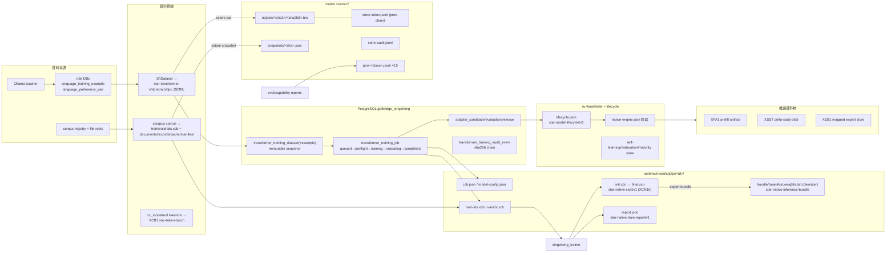

# 星澄／完整資料圖

> 規範性檢視檔。本檔只鏡像資料格式、權責與流向，不複製任何權威資料內容。格式 tag、schema 與欄位以權威源（xstore/CONTRACT.md、xcb.rs、xcn1.rs、Repository.cs、Policy.cs）為準。

## 資料流總覽



## 二進位容器家族

| Magic | format tag | 生產者 | 內容 |
|---|---|---|---|
| `XCN1` | `star-native-ckpt/v1` | trainer `ckpt_save` | versioned config + tensor table (name/dims/f32)；v10 加 mtp 欄位 + gemma4 marker |
| `XCB1` | `star-token-batch/v1` | xcorpus / modeltool tokenize | meta JSON + records{kind 1-4, ids, labels, rej, vision} |
| `XPA1` | `star-prefill-artifact/v1` | engine `prefill_artifact` | token_ids + KV + XSST + logits + sha256 tail |
| `XSST` | （內嵌子 blob） | engine | delta-state |
| `XEB1` | `star-mapped-expert-store/v1` | expert-store-build | 128B index entries + INT8 expert payloads + sha |

不存在（勿當既有 contract）：`XDS`/`XCR`/`XST`/`XEV`；`.pt` 退役（fail-closed `EXECUTOR_INIT_CHECKPOINT_RETIRED`）。

## xstore 儲存佈局

```
<store>/
├── objects/<sha2>/<sha256>.bin    immutable content-addressed bodies
├── tmp/*.tmp                      fsync+rename spill
├── store-index.jsonl              star-store-index/v1, prev-chained receipts
├── snapshots/<manifest-sha>.json  star-dataset-snapshot/v1
└── store-audit.jsonl              star-audit-log/v1 (prev=sha256 of prev raw line)
```

## corpus 輸出佈局

```
<out>/
├── train-ids.xcb / valid-ids.xcb   XCB1 kind=1, meta{producer,packing_max_len,tokenizer_sha256}
├── documents.jsonl                 fixed field order; dataset_version=sha256(本檔)
├── train-records.jsonl / valid-records.jsonl   {path, sha256=overlap_sha}
├── corpus-cache.jsonl              star-corpus-file-cache/v1 (ids_b64; legacy ids readable)
└── manifest.json                   star-pretrain-corpus/v1 (counts/languages/integrity)
```

## job 目錄佈局

```
jobs/<id>/
├── train-src.jsonl / val-src.jsonl   來源行（{prompt,completion}|{text}|{prompt,chosen,rejected}）
├── train-ids.xcb / val-ids.xcb       tokenize 輸出（trainer 只用 train）
├── init.xcn                          bundle → XCN（init 為 bundle 時）
├── job.json / model-config.json      trainer 規格 + scratch manifest
├── report.json                       star-native-train-report/v1
├── train-stderr.log
├── final.xcn                         XCN10 checkpoint
└── bundle/                           manifest.json + weights.bin + tokenizer.json
                                     (star-native-inference-bundle/v1 + provenance block)
```

## JSONL/JSON artifact 索引（producer → consumer）

| 檔案 | format | 生產者 → 消費者 |
|---|---|---|
| snapshot JSONL | `star-transformer-sft/pretrain/dpo` | SftDataset → trainer data.path |
| documents/records/cache | `star-corpus-file-cache/v1` 等 | xcorpus → capability overlap gate |
| corpus manifest | `star-pretrain-corpus/v1` | xcorpus → C#/評估 |
| store-index/audit/snapshot | `star-store-index`/`star-audit-log`/`star-dataset-snapshot` | xstore 自鏈 |
| report.json | `star-native-train-report/v1` | trainer → JobExecutor（+resource enrichment） |
| eval/capability report | `star-native-eval-suite`/`star-capability-eval` | modeltool → adapter_evaluation + failure pool |
| lifecycle.json | `star-model-lifecycle/v1` | Lifecycle.cs ↔ 全治理 lane |
| model-service.json | `star-model-service-descriptor/v1` | ToolHost → consumers |
| self-learning.json | `star-self-learning-state/v1` | SelfLearning 自讀寫 |
| model-maturation-300m.json | `star-300m-maturation-state/v1` | Maturation300M |
| runtime-host owner.lock / artifact-registry.json | `star-runtime-host`/`star-artifact-registry` | SiliconRuntime |
| pool-*.jsonl | `star-capability-failure-pool/v1` | C# FailurePool ⇄ Rust xstore（互通 canonical JSON） |
| retention/self-learning-*.json(l) | 報告/收據 | logs/ 稽核 |

## PostgreSQL 表（`gptbridge_xingcheng`）

| 表 | 關鍵約束 |
|---|---|
| `transformer_schema_metadata` | schema_version key |
| `transformer_training_dataset` | UNIQUE(content_sha256,snapshot_sha256)；UPDATE/DELETE trigger 禁改（snapshot immutable） |
| `transformer_training_dataset_example` | PK(dataset_id,ordinal)；UNIQUE(dataset_id,content_sha256) |
| `transformer_training_job` | status 狀態機 queued→preflight→training→validating→completed/failed/cancelled |
| `transformer_adapter_candidate` | artifact_sha256 UNIQUE；partial UNIQUE on status=active |
| `transformer_adapter_evaluation` | UNIQUE(adapter_id,suite_sha256) |
| `transformer_adapter_release` | action∈stage/activate/rollback/retire |
| `transformer_runtime_model_state` | singleton；automatic_weight_replacement 必為 0 |
| `transformer_training_audit_event` | sha256 鏈（prev=前筆 canonical hash）；UPDATE+DELETE trigger immutable |

role DBs：`gptbridge_xingcheng_{main,investment,mathematical,coding}`（唯讀收集）。
identity：`xingcheng_identity`（RLS，`gptbridge_xingcheng_internal` 唯一內部 role）。

## 資料邊界

- 不受信任輸入（checkpoint、manifest、語料、大 binary）只經 Rust lane 剖析。
- 稽核鏈三處並存：PG `audit_event` 鏈、xstore `store-audit.jsonl`、治理 JSONL；尾端截斷需外部錨定。
- 版本政策：新 contract 不釘版本（`star-kernel-*`）；既有 `/vN` 為註冊名稱本體。
