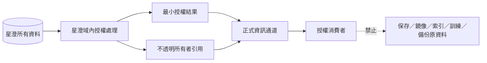

# 星澄資料唯讀鏡像

> 非規範性衍生文件。本檔只鏡像資料分類、權責與流向，不複製任何星澄資料內容。

## 資料分類

- 身分、人格、記憶與對話脈絡
- 語料、資料集、訓練狀態與學習證據
- 權重、檢查點、候選、評估與生命週期紀錄
- 知識、檢索資料、工具使用狀態與執行紀錄
- 修復、更新、保留、恢復、遷移及刪除證據

## 鏡像限制

- 本檔不含資料列、內容、雜湊衍生祕密、嵌入、權重、提示或可還原資訊。
- 星澄資料仍只保留在星澄所有域；本檔不是資料備份、快取、索引或訓練來源。
- 類別與流向若與現行權威衝突，以現行法典及正式登錄表為準。
