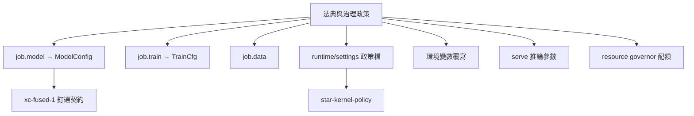

# 星澄／完整參數圖

> 規範性檢視檔。參數面僅列出類別與約束；合法值、預設、路徑、命令與調校細節以權威源為準。本表鏡像權威源（`xct_util.h`、`xct_job.h`、`xct_kernels.h`、Policy.cs、specs/*.json），若與現行權威衝突以權威源為準。

## 參數面總覽

## job.model → ModelConfig（xct_util.h:71-574）

| 分組 | JSON key → 欄位 (預設) |
|---|---|
| 核心 | `vocab_size`→vocab(32000) · `hidden_size`→hidden(512) · `intermediate_size`→inter(1376) · `num_hidden_layers`→layers(6) · `num_attention_heads`→heads(8) · `num_key_value_heads`→kv_heads(8) · `max_position_embeddings`→max_pos(4096) · `rope_theta`(1e4) · `rms_norm_eps`(1e-6) · `generation`(僅 `xc-fused-1` 合法) |
| MoE | `moe_num_experts`(0=dense) · `moe_top_k`(2) · `moe_layer_interval`(1) · `moe_aux_loss_weight`(0.01) · `moe_router_sigmoid`(F) · `moe_expert_intermediate_size`(0→inter) · `moe_num_shared_experts`(0) · `moe_shared_intermediate_size` · `shared_expert_gate`(F) · `moe_z_loss_weight`(0) · `moe_auxfree_balance`(F) · `moe_lb_bias_rate`(0) |
| DeltaNet hybrid | `full_attention_interval`(0=dense) · `attn_output_gate`(F) · `qk_norm`(F) · `partial_rotary_factor`(1.0) · `linear_num_key_heads` · `linear_key_head_dim` · `linear_num_value_heads` · `linear_value_head_dim` · `linear_conv_kernel_dim`(4) |
| Gemma4 | `model_type`(gemma4_text\|gemma4) · `layer_types[]` · `head_dim` · `global_head_dim` · `sliding_window_size` · `global_attention_interval` · `num_global_kv_heads` · `k_eq_v_global` · `local/global_rope_proportion` · `local/global_base_frequency` · `final_logit_softcapping` · `use_post_attn/ffw_norm` · `hidden_activation` · `num_kv_shared_layers` · `hidden/vocab_size_per_layer_input` · `use_double_wide_mlp` · `tie_word_embeddings` · `query_pre_attn_scalar` |
| MLA | `kv_lora_rank` · `q_lora_rank` · `qk_nope_head_dim` · `qk_rope_head_dim` — 與 CSA 互斥 |
| CSA2 | `csa_compress_ratio`(<2 停用,=1 throw) · `csa_topk` · `csa_window_size` · `csa_compress_rope_theta` · `csa_share_group` · `csa_reindex` · `csa_indexer`(T) · `csa_indexer_loss_weight`(1.0) |
| MTP | `num_nextn_predict_layers` · `mtp_loss_weight` · `mtp_stack_depth` · `mtp_stack_loss_weight` |
| YaRN | `yarn_factor` · `yarn_original_max_position_embeddings` · `yarn_beta_fast`(32) · `yarn_beta_slow`(1) · `yarn_attention_factor` |
| Vision | `use_vision`(F) · `vision_patch_dim` · `vision_max_patches` |

**`xc-fused-1` 釘選**（覆寫非合併）：interval=4 DeltaNet + gated/qk-norm/partial-rotary attention + sigmoid MoE top-2 + shared expert gated + MTP stack ≥1 + vision + YaRN ≥2；排除 MLA/CSA/Gemma4/aux-free/k_eq_v/PLE。驗證面：`canon_cfg_eq` 35 欄位、`--canoncheck`、`--canonical-materialize`（drift → `ARCHITECTURE_CONTRACT_DRIFT`）。

## job.train → TrainCfg（xct_job.h:186-434）

| key | 預設 | key | 預設 |
|---|---|---|---|
| `lr` | 3e-4 | `weight_decay` | 0.01 |
| `grad_clip` | 1.0 | `beta` (DPO) | 0.1 |
| `warmup_steps` | 0 | `max_steps` | 100 |
| `log_every` | 10 | `checkpoint_every` | 0 |
| `seed` | 42 | `deadline_s` | 0 |
| `lr_decay` | cosine | `init_checkpoint` | — |
| `emit_checkpoint` | — | `overwrite` | F |
| `group_size` (GRPO) | 4 [2,8] | `max_new_tokens` | 8 [1,64] |
| `temperature` | 1.0 | `kl_coef` | 0.02 |
| `reward` | exact\|prefix | `threads` | 0=auto(≤16) |
| `simd` | T | `freeze[]` | glob patterns（≤64） |

AdamW 內部常數 b1=0.9 b2=0.999 eps=1e-8 不可配。

## job.data

`path`(必要；XCB1 magic-sniff else JSONL) · `format`(sft\|pretrain\|dpo\|grpo\|ids) · `max_rows`(10000) · `max_len`(→max_pos) · `pack`(0；僅 sft/pretrain/ids) · `pack_sep`(-1)。

## 環境變數

| var | 效果 |
|---|---|
| `XCT_TPU_THREADS` / `XCT_TPU_SIMD=0` / `XCT_TPU_TILE4=0` | 覆寫 train.threads / simd / tile4 GEMM |
| `XCT_KERNEL_POLICY` / `--kernel-policy` | kernel 政策路徑（arg > env） |
| `XINGCHENG_TRAINER_CUDA_OPT` | CUDA AdamW lane opt-in |
| `XINGCHENG_CPP_CUDA` / `_BF16` / `_FP8`(與bf16互斥) / `_KV` / `_GRAPH` / `_KV_INT8` | engine CUDA/量化 opt-in |
| `GPTBRIDGE_POSTGRES_DSN` / `XINGCHENG_SHARED_PG_SCHEMA` | PG 連線/schema |

## 政策/設定檔

| 檔案 | format | 關鍵欄位 |
|---|---|---|
| `runtime/settings/self-learning.json` | `star-self-learning-policy/v1` | enabled, min_new_examples(24), auto_activate, suites[], max_steps(400), lr(5e-5), quiet_hours 22:00-07:00, inference_exclusion(T), capability_training_frozen, capability_training_mode, dpo_*, self_training_mode, degradation_probe_* 等 40+ keys |
| `runtime/settings/retention.json` | `star-retention-policy/v1` | enabled, keep_job_dirs(3), keep_logs_days(30), keep_maturity_reports(10), keep_snapshots(5), keep_weight_versions(1) |
| `runtime/settings/native-engine.json` | — | enabled, checkpoint 釘選, cpu_threads, cpp_cuda, sampling |
| `runtime/settings/kernel-policy.json` | `star-kernel-policy` | enabled, force_serial, max_threads, deny_variants[simd\|tile4\|cuda], deny_kernels[] |
| `runtime/settings/teacher-distillation.json` | `star-teacher-distillation-policy/v1` | enabled(F), teachers{}, prompts[], max_rows(24), quality_score(0.92), temperature(0.2) |

## serve 推論參數

`infer`: prompt\|messages, sampling_profile(6 presets), temperature/top_k/top_p/repetition_penalty/seed, max_new_tokens(192, ≤2048), persona/narrative/factuality, prefix_scope。`think`: think_steps(≤32), branches(≤8)。engine limits: `set_kv_memory_limit`, `set_prefix_cache_limit`(8 entries/256MiB), CUDA memplane tiers + 8-step pressure ladder。

## Governor 配額（native/resource_governor）

8 工作類別；shed 序 training-first，fill 序 model-first；pressure none/pre/active；`total_quota ≤ logical_cores`；preflight 讀 `resource-governor.json` → `threads=clamp(quota,1,16)`，`quota==0 ⇔ paused`。

## 引擎 ModelConfig（xingcheng_inference.hpp — bundle-facing）

與 trainer config 獨立：`bos_token_id=1, eos_token_id=2, pad_token_id=0, use_swiglu, tie_word_embeddings, norm_type, hidden_act, quantization="none"`；Gemma4 面（model_family/layer_types/embedding_scale 等）與 MoE/vision/hybrid/MTP/YaRN 同名對映。
