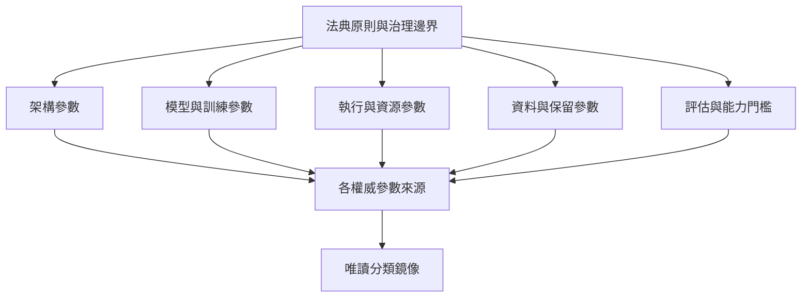

# 星澄參數唯讀鏡像

> 本圖只呈現法典中的參數分類與約束關係，不保存可執行設定、不指定實作值，也不取代權威參數來源。

```mermaid
flowchart TD
    POLICY[法典原則與治理邊界] --> ARCH[架構參數]
    POLICY --> MODEL[模型與訓練參數]
    POLICY --> RUNTIME[執行與資源參數]
    POLICY --> DATA[資料與保留參數]
    POLICY --> EVAL[評估與能力門檻]
    ARCH --> SOURCE[各權威參數來源]
    MODEL --> SOURCE
    RUNTIME --> SOURCE
    DATA --> SOURCE
    EVAL --> SOURCE
    SOURCE --> MIRROR[唯讀分類鏡像]
```

具體數值、版本、路徑、命令與調校方式均留在各自權威來源；本鏡像不複製或凍結這些實作細節。
